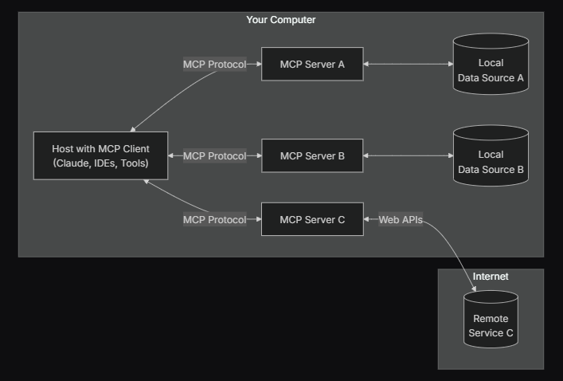

# [MCP](https://modelcontextprotocol.io/introduction)

## 定义

MCP（Model Context Protocol，模型上下文协议），2024年11月底，由 Anthropic 推出的一种开放标准，旨在统一大型语言模型（LLM）与外部数据源和工具之间的通信协议。MCP 使得 AI 应用能够安全地访问和操作本地及远程数据，为 AI 应用提供了连接万物的接口。实际上比起协议，我个人觉得它更偏向于约定的一种模块功能调用架构。

## 为什么选择 MCP

MCP 可帮助您在 LLM 之上构建可通用的代理和工作流。LLM 通常需要与数据和工具集成，而 MCP 可提供：

- LLM 可以直接插入不断增加的预构建集成列表

    通常我们编写工具调用模块，需要根据模型本身的工具调用支持功能和工具自身的调用情况高耦合开发硬编码，如果这些工具资源需要给其他项目或模型使用，则需要重复开发工具代码；而使用MCP协议，则遵循MCP提供的规范就可以分离调用模型和使用工具的部分，从而实现工具插拔式接入。

- 在 LLM 提供商和供应商之间切换的灵活性
- 保护基础架构内数据

## 工作原理

Anthropic提供了一套[MCP api](https://modelcontextprotocol.io/quickstart/client)实现MCP协议，MCP 协议采用了一种独特的架构设计，它将 LLM 与资源之间的通信划分为三个主要部分：`MCP客户端`、`MCP服务器`和`资源`。

`MCP客户端`: 客户端负责发送用户请求给 MCP 服务器

`MCP服务器`: 提供资源，工具，提示，供大模型使用

以下是 MCP 的工作原理：

- MCP Hosts: 希望通过MCP协议访问数据的LLM程序，像 Cursor, Claude Desktop、Cline 这样的应用程序。
- MCP Clients: 客户端是用来在 Hosts 应用程序内维护与 Server 之间 1:1 连接。
- MCP Servers: 通过标准化的协议，**为 Client 端提供上下文、工具和提示**。
- Local Data Sources: 本地的文件、数据库和 API。
- Remote Services: 外部的文件、数据库和 API。

## [案例](./demo)

该案例创建了

- MCP Client

    使用deepseek模型访问MCP Serve查询美国天气。

- MCP Serve

    提供了查询美国天气的tools，供客户端使用。