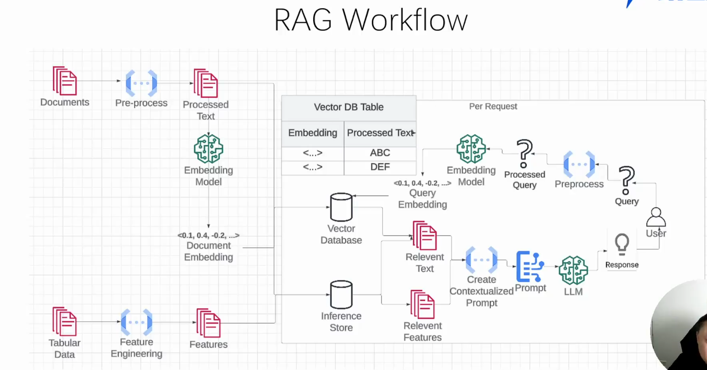

# RAG(检索增强生成)

## 为什么需要RAG技术

大模型预训练结束后，其内部的数据就固定了，无法从从外部获取新的数据。如果需要对特定行业开发Agent程序，单单使用大模型是无法满足知识需求的。比如你不可能询问大模型你们公司今年的财务数据统计结果，这是公司内部的私有数据，不可能包含在大模型的预训练数据中。此时为了让大模型新增这些知识，从难到易有四种方式。

- 重新训练或从头构建模型：成本高，更新数据困难。
- 微调模型(fine tuning)：成本高，更新数据困难。
- 动态提示（RAG是其中的一种方式）：需要提供外部文档，需要开发代码；更新数据方便；
- 简单提示工程：只需要修改面对大模型的提示词就可

## 什么是RAG

检索增强生成（RAG）是指对大型语言模型输出进行优化，RAG 事实上是在传统信息检索技术的基础上，结合生成模型的一种增强型方法。使其能够在生成响应之前引用训练数据来源之外的权威知识库,它的核心思想是通过结合外部的知识库或文档检索机制，增强生成模型的表现。

RAG相比微调具备的优势，不仅能依赖于模型本身的训练数据，还能实时从外部知识库获取最新的、相关的知识，从而生成更为准确和详细的回答。

## RAG workflow

### 第一部分 构建知识库（RAG技术中的难点）

1. 文档预处理

    将pdf,execl等文档转换为普通文本。

2. 文本切分

   - 根据某种文本长度条件切分成多个chunks，适合纯文本文件。
   - 基于NLP篇章分析工具，适合包含图片，表格的复杂文本
   - 基于BERT中NSP训练一个用于分割内容的模型。

3. 文本向量化（embedding）

    将文本转化为向量。目前多是通过`embedding模型`处理文本

4. 向量存储（vector DB ）

    将得到的向量存储到向量数据库。
 
    - FAISS: Meta开源的向量检索引擎
    - Chroma： 开源向量数据库，同时又云 服务
    - Pinecone：商用向量数据库，只有云服务
    - Milvus: 开源向量数据库，同时有云服务
    - Weaviate：开源向量数据库马，同时有云服务
    - Qdrant: 开源向量数据库，同时有云服务
    - PGVector： Postgres的开源向量检索引擎
    - RediSearch：Redis的开源检索引擎
    - ElasticSearch： 也支持向量检索

### 第二部分 数据存储和查询 

1. 检索

    基于向量（语义）的相似度检索，RAG会先从一个知识库中检索相关的信息。这些信息通常是与输入的查询或任务相关的文本。

2. 生成

    获取到相关文档后，RAG将这些文档作为上下文输入到生成模型(这通常不需要推理模型)中，然后生成最终的答案或文本。

## 实现RAG的框架或方式

- LLM + FAISS

    实现基于文本的RAG,FAISS（Facebook AI Similarity Search）是一个高效的向量搜索库，专门用于快速相似性搜索，主要应用于大规模向量数据的最近邻搜索。使用大模型api和FAISS手动实现数据向量存储搜索，适合本地小型向量存储，高速。

    缺点：需要较多的手动配置：设置 FAISS 索引和 LLM 之间的连接可能需要一定的工作量。集成复杂：需要开发者处理模型的选择、向量化、索引构建和查询处理。

- LlamaIndex

    [案例](./LlamaIndex/)

    LlamaIndex（原名 GPT Index） 是一个专为大语言模型（LLM）优化的知识检索框架，用于构建 RAG（Retrieval-Augmented Generation，检索增强生成）系统。LlamaIndex 提供了抽象化的接口，使得开发者能够更方便地配置、索引和查询，无需手动管理底层细节（如 FAISS 索引）。

    LlamaIndex内置默认使用open AI提供的模型，若要使用其他模型，需要自定义配置类，使用较为复杂。

- LangChain

    快速开发，适合 API 级 RAG，开发快速但封装过多，复杂。