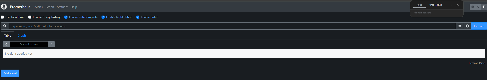
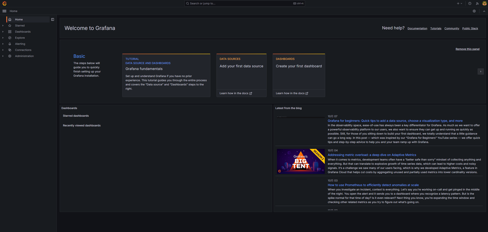

# 基于 Prometheus + Grafana 的监控平台

[Prometheus(普罗米修斯)](https://prometheus.io/)是一款开源的监控系统，针对容器化环境提供了强大的支持，例如自动发现和监控，这对于容器即开即用的特点至关重要，使其能够称为监控 Docker,k8s 的首选解决方案。

Prometheus 在监控可视化方面的功能比较薄弱，它仅仅提供了一个简单的 Web UI,难以满足企业对监控可视化的需求。为了填补这一不足，Prometheus 通常会与 Grafana 结合使用，形成一套完整的可视化监控方案。

[Grafana](https://grafana.com/) 是一款开源的数据可视化系统，它提供了丰富的可视化功能，包括仪表盘、图表等，可以以直观的方式展示监控数据。Grafana 支持多种数据源，如 Prometheus，InfluxDB,MySQL 等，因此在监控可视化领域得到了广泛的应用。

## 部署 Prometheus + Grafana

### 部署 Prometheus

1. 在 etc/prometheus/prometheus.yml 目录下准备配置文件如下

```yaml
global:
  # 数据采集间隔
  scrape_interval: 15s
  # 告警检测间隔
  evaluation_interval: 15s
# 告警规则
rule_files:
# 采集配置
scrape_configs:
  # 采集项(prometheus)
  - job_name: "prometheus"
    static_configs:
      # 抓取配置，可以配置多个作业，每个作业可以添加监控目标。
      - targets: ["localhost:9090"]
```

2. docker 部署

```linux
docker network create monitoring

docker run -d \
    --name=prometheus  \
    --net=monitoring \
    -v /etc/prometheus:/etc/prometheus/ \
    -v prometheus-data:/prometheus \
    -p 9090:9090 \
    prom/prometheus:latest

```

访问宿主机 9090 端口可查看页面


### 部署 Grafana

1. docker 部署

```linux
docker run -d \
    -p 3000:3000 \
    --name=grafana \
    --net=monitoring \
    -v grafana-data:/var/lib/grafana \
    grafana/grafana:latest
```

访问宿主机 3000 端口可查看页面,默认账户密码 admin/admin


### 将 Prometheus 作为数据源加入 Grafana

进入 Connections=> Data sources => Prometheus。进入配置页面，在 HTTP 部分填入 Prometheus 访问地址，并单击 Save&test 按钮进行保存和测试。
