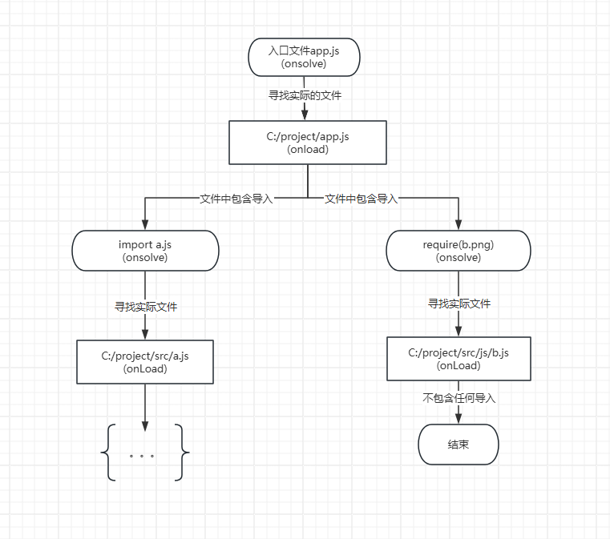

# 插件

可以查找[community-plugins](https://github.com/esbuild/community-plugins)寻找 esbuild 插件，这是作者提供的一个集中的第三方插件列表。

**需要注意的是，该网址中的插件并非是官方插件，而是社区提供的**。

## 如何使用插件

每个插件都是包含了一个`name`和`setup`的函数。他们存在于一个`plugins`数组中以便被`esbuild Api`顺序调用，每个插件的`setup`函数仅会被`esbuild Api`调用一次.

以下是一个 demo 插件，允许你构建时导入当前变量

```js
import * as esbuild from "esbuild";

let envPlugin = {
  name: "env",
  setup(build) {
    //拦截名为“env”的导入路径，这样esbuild就不会尝试将它们映射到文件系统位置。用“env-ns”标记它们命名空间,为该插件保留它们。
    build.onResolve({ filter: /^env$/ }, (args) => ({
      path: args.path,
      namespace: "env-ns",
    }));

    //加载标记有“env-ns”命名空间的路径，并表现得像它们指向一个包含环境变量的JSON文件。
    build.onLoad({ filter: /.*/, namespace: "env-ns" }, () => ({
      contents: JSON.stringify(process.env),
      loader: "json",
    }));
  },
};

await esbuild.build({
  entryPoints: ["app.js"],
  bundle: true,
  outfile: "out.js",
  plugins: [envPlugin],
});
```

你可以像这样使用它

```js
import { PATH } from "env";
console.log(`PATH is ${PATH}`);
```

## 如何开发插件

为 esbuild 编写插件的工作方式与为其他打包器编写插件略有不同。在开发插件之前，了解以下概念很重要：

- 命名空间（Namespaces）

  每个模块都有一个关联的命名空间。默认情况下，esbuild 在文件命名空间中运行，该命名空间对应于文件系统上的文件。但是 esbuild 也可以处理在文件系统上没有相应位置的“虚拟”模块。当使用 stdin 提供模块时，就会发生这种情况。

  插件可用于创建虚拟模块。虚拟模块通常使用文件以外的命名空间来将其与文件系统模块区分开来。通常，名称空间特定于创建它们的插件。

- 过滤器（Filters）

  每个 esbuild 回调函数中必须提供一个正则表达式作为过滤器，当**路径**不匹配时，esbuild 跳过此回调。

### esbuild call back

esbuild 插件解析是一颗递归的路径图，它会从入口文件开始解析,加载，进行如下列顺序的回调执行。。



#### On-resolve callbacks

该回调用于拦截并处理模块解析（resolution）阶段的操作，当 esbuild 遇到 import 或 require 语句时，它会尝试解析模块路径从而找到对应的源文件，而 onResolve 允许你自定义处理这些路径。

主要用途包括

- 自定义模块路径解析
- 处理虚拟模块
- 阻止模块解析

```js
import * as esbuild from "esbuild";
import path from "node:path";

let exampleOnResolvePlugin = {
  name: "example",
  setup(build) {
    // 重定向所有以"images/"开头的解析路径到"./public/images/"
    build.onResolve({ filter: /^images\// }, (args) => {
      return { path: path.join(args.resolveDir, "public", args.path) };
    });

    // 标记所有以https://或者http://开头的路径为外部资源，不做任何处理。
    build.onResolve({ filter: /^https?:\/\// }, (args) => {
      return { path: args.path, external: true };
    });
  },
};

await esbuild.build({
  entryPoints: ["app.js"],
  bundle: true,
  outfile: "out.js",
  plugins: [exampleOnResolvePlugin],
  loader: { ".png": "binary" },
});
```

`onResolve`回调函数可以不提供返回路径结果，这时会将路径解析的责任传递给下一个回调函数，对于一个导入路径来说，所有插件中注册的`onResolve`回调函数会按照他们注册顺序依次运行，直到一个回调函数负责处理路径解析，如果没有任何回调返回路径，`esbuild`将使用默认路径解析逻辑。

`onResolve`函数可能同时运行很多个。在 JS 中，如果存在某个昂贵的函数，应该尝试在另一个线程上运行，比如使用异步。

- **On-resolve options**

  `onResolve`函数参数如下

  ```js
  interface OnResolveOptions {
    // 必填参数，正则表达式，如果没有匹配到任何路径，则会跳过本次回调。
    filter: RegExp;
    // 可选参数，如果提供，则回调仅在提供的命名空间中的模块内的路径上匹配正则。
    namespace?: string;
  }
  ```

- **On-resolve arguments**

  `onResolve`回调参数如下

  ```js
  interface OnResolveArgs {
    // 当前正在解析的模块的原始路径（ import 或 require 语法中引用的路径）。
    path: string;
    // 当前被解析的导入语句所在文件的绝对路径（ import 或 require 语法所在文件）
    // 只有当命名空间为`file`的情况下，该路径才一定是文件系统路径。因为该参数不适用于虚拟模块。
    // 入口文件的importer为空
    importer: string;
    // 当前被解析模块所属的命名空间。
    // 默认namespace为`file`,所有从文件系统加载的模块namespace都是该值；也可以通过onLoad函数自定义namespace。这是为了更好的扩展解析逻辑。
    namespace: string;
    // 当前正在解析的模块代码文件所在文件目录的绝对路径。esbuid会在该目录下查找导入模块的实际文件。
    // 当命名空间为`file`的情况下，该路径是文件系统路径。如果是虚拟模块，该值默认为空。
    // 该值可以由onLoad设置
    resolveDir: string;
    // 用于指示当前解析的模块类型。
    kind: ResolveKind;
    // 传递自定义的数据到`onLoad`中使用。（未完成）
    pluginData: any;
    // 提供一个map值（未完成）
    with: Record<string, string>;
  }

  type ResolveKind =
    // 入口文件
    | "entry-point"
    // 来源于JS中的import
    | "import-statement"
    // 来源于JS中的require
    | "require-call"
    // 来源于 动态 import()
    | "dynamic-import"
    // 来源于 require.resolve()
    | "require-resolve"
    // 来源于css中的@import
    | "import-rule"
    // 来源于css中的composes
    | "composes-from"
    // 来源于css中的url()
    | "url-token";
  ```

- **On-resolve results**

  `onResolve`返回结果如下

  ```js
  interface OnResolveResult {
    // 设置为true,则标记该import作为外部资源，esbuild不会将该import模块放入捆绑包，而是作为运行时import导入。
    external?: boolean;
    // 和解析路径相关的命名空间，如果未设置或设置为空，则会将非external的文件路径视为`file`命名空间。
    namespace?: string;
    // 如果该值被设置为非空字符串（文件路径，网络URL等），则esbuild会将指定地址内容作为import模块加载的内容且其余关于该import模块的`on-resolve`将不再被调用。如果未设置，esbuild将继续解析后续关于该import的`on-resolve`。如果最后仍旧未设置该值，则执行 默认路径解析逻辑
    path?: string;
    // 传递给`onLoad`的数据
    pluginData?: any;
    //用于指定当前解析结果是由哪个插件处理的。用于帮助调试和追踪路径解析的来源。当多个插件同时处理路径解析时，通过 pluginName 可以清楚地知道哪个插件负责解析了当前路径。
    pluginName?: string;
    // 声明该模块是否具备副作用，帮助esbuild更加精确的执行树摇优化，设置为true,标识该模块具有副作用，即使未被使用，也不应当被树摇优化，优先级大于`package.json`中的sideEffects
    sideEffects?: boolean;
    // 提供一段自定义路径后缀信息给onLoad使用，和pluginData相比数据类型更简单，但是设计该字段数据的意义是为了路径信息关联，附加额外路径信息。
    suffix?: string;
    // 传递错误日志给esbuild显示在终端中,会立即停止本次构建
    errors?: Message[];
    // 传递警告日志给esbuild显示在终端中
    warnings?: Message[];
    // 设置额外的文件目录数组路径，使得esbuild watch模式检测这些目录数量改变时重新触发esbuild构建，这不会自动递归检查子目录，如果需要包含监听子目录，需要手动添加所有的子目录。
    watchDirs?: string[];
    // 设置额外的文件监听，默认情况下，esbuid只会监听被`onload`解析的命名空间为`file`的文件。当文件修改时，重新触发构建。
    watchFiles?: string[];
  }

  interface Message {
    // 消息内容
    text: string;
    // 问题发生位置
    location: Location | null;
    detail: any; // The original error from a JavaScript plugin, if applicable
  }

  interface Location {
    // 文件地址
    file: string;
    // 命名空间
    namespace: string;
    // 具体行数
    line: number; // 1-based
    // 具体列数
    column: number; // 0-based, in bytes
    length: number; // in bytes
    lineText: string;
  }
  ```

#### On-load callbacks

esbuild 中用于处理和转换模块内容的钩子。可以对加载的模块进行处理，例如编译、转换文件内容或提供自定义的加载逻辑,然后提供给一个返回内容。

`onLoad`可以存在很多个，esbuild 将会按照他们注册的顺序执行。`onLoad`可以不提供返回内容，这时模块将会被传递到下一个`onLoad`处理，如果所有的`onLoad`都没有返回内容，那么 esbuild 将执行默认的返回逻辑。

onLoad 回调在文件被加载后执行

主要用途包括

- 修改文件的内容。
- 编译某些类型的文件（如 TypeScript、SASS、或其他自定义格式）。
- 提供自定义的加载器，将外部资源或虚拟模块转化为有效的 JavaScript 代码。

以下是一个将`.txt`文件内容转换为 json 数组的例子

```js
import * as esbuild from "esbuild";
import fs from "node:fs";

let exampleOnLoadPlugin = {
  name: "example",
  setup(build) {
    // Load ".txt" files and return an array of words
    build.onLoad({ filter: /\.txt$/ }, async (args) => {
      let text = await fs.promises.readFile(args.path, "utf8");
      return {
        contents: JSON.stringify(text.split(/\s+/)),
        loader: "json",
      };
    });
  },
};

await esbuild.build({
  entryPoints: ["app.js"],
  bundle: true,
  outfile: "out.js",
  plugins: [exampleOnLoadPlugin],
});
```

- **On-load options**

  ```js
  interface OnLoadOptions {
    // 必填参数，正则表达式，如果没有匹配到任何路径，则会跳过本次回调。
    filter: RegExp;
    // 可选参数，如果提供，则回调仅在提供的命名空间中的模块内的路径上匹配正则。
    namespace?: string;
  }
  ```

- **On-load arguments**

  ```js
  interface OnLoadArgs {
    // 如果命名空间是`file`,则该值是模块的绝对路径，否则取决于插件的实现，比如可以是URL，虚拟路径，或者其他，比如官方的HTTP插件示例。
    path: string;
    // 模块路径所在的命名空间，可以由该模块的`onSolve`设置，默认情况，命名空间为`file`。
    namespace: string;
    // 使用`onResolve`提供的suffix
    suffix: string;
    // 使用`onResolve`提供的pluginData
    pluginData: any;
  }
  ```

- **On-load results**

  ```js
  interface OnLoadResult {
    // 设置模块的实际内容，如果该值设置，则后续该模块路径的`onLoad`不在执行，如果不设置，则继续运行后续的`onLoad`直到获取返回值，如果依旧没有，则返回esbuild默认返回值逻辑。
    contents?: string | Uint8Array;
    // 指定模块的解析方式，如果返回`js`,则该模块将视为js文件解析，返回`css`，被视为css文件解析。默认为js，
    loader?: Loader;
    // 传递给`onSolve`的数据
    pluginData?: any;
    //用于指定当前解析结果是由哪个插件处理的。用于帮助调试和追踪路径解析的来源。当多个插件同时处理路径解析时，通过 pluginName 可以清楚地知道哪个插件负责解析了当前路径。
    pluginName?: string;
    // 设置当前模块内容中的导入路径模块的实际解析目录，默认为模块路径的目录部分。此路径会传递给为解析过的导入的`onSolve`回调
    resolveDir?: string;
    // 传递错误日志给esbuild显示在终端中,会立即停止本次构建
    errors?: Message[];
    // 传递警告日志给esbuild显示在终端中
    warnings?: Message[];
    // 设置额外的文件目录数组路径，使得esbuild watch模式检测这些目录数量改变时重新触发esbuild构建，这不会自动递归检查子目录，如果需要包含监听子目录，需要手动添加所有的子目录。
    watchDirs?: string[];
    // 设置额外的文件监听，默认情况下，esbuid只会监听被`onload`解析的命名空间为`file`的文件。当文件修改时，重新触发构建。
    watchFiles?: string[];
  }
  ```

- **Caching your plugin**

  esbuild 本身是非常快的，因此构建的速度瓶颈通常是由插件限制，而插件的缓存逻辑是由每个插件本身控制的，并非 esbuild。

  缓存本质上是一个数据映射 Map 集合，用于存储插件的转换，通常 key 是转换函数的输入，value 是转换函数的输出，此外还会存在一些缓存驱除策略，防止随着时间的推移，缓存不断增大。

  缓存可以存储在内存中，磁盘中，服务器中，具体根据需求决定

  以下一个具备缓存插件的例子，他缓存了 example 插件中经过 slowTransform 函数转换的值。假设 slowTransform 函数是一个文本压缩的函数。

  ```js
  let examplePlugin = {
    name: "example",
    setup(build) {
      let fs = require("fs");
      // 创建键值对，缓存在内存中
      let cache = new Map();

      build.onLoad({ filter: /\.example$/ }, async (args) => {
        let input = await fs.promises.readFile(args.path, "utf8");
        let key = args.path;
        // 转换之前，先查询缓存中是否存在，且输入是否相同，满足条件则使用缓存
        // 否则转换数据并更新缓存
        let value = cache.get(key);
        if (!value || value.input !== input) {
          let contents = slowTransform(input);
          value = { input, output: { contents } };
          cache.set(key, value);
        }

        return value.output;
      });
    },
  };
  ```

  上述代码中可能存在一些问题

  1. 没有做缓存驱除策略，随着时间的推移，缓存映射可能会变得越来越大，导致内存被占满。我们可以用文件路径作为 key,文件内容输入和输出作为 value，这样映射就不会越来越大，这种方式适合单一文件的重复编辑。对于文件路径经常修改的缓存策略，需要使用更高级的驱逐缓存策略。

#### On-start callbacks

该回调会在构建开始时执行，不仅仅是初次构建，每次重新构建都会执行

```js
let examplePlugin = {
  name: "example",
  setup(build) {
    build.onStart(() => {
      console.log("build started");
    });
  },
};
```

这个回调不应该用来执行初始化操作，应为可能会被执行多次，初始化操作可以放在`setup()`中

`onStart`回调可以是异步的,所有的插件的`onStart`回调是**并行执行**的，只有当所有插件的`onStart`回调执行结束才会开始进行接下来的操作。

`onStart`无法修改`setup()`的`build options`,该值只能在`setup()`修改，`onStart`中操作 `build options`会被忽略。

#### On-end callbacks

该回调会在构建结束时运行。不仅仅是初次构建，每次重新构建都会执行

onEnd 回调会在所有构建任务完成后被调用，并接受一个包含构建结果的对象作为参数。这个对象包含有关构建过程的详细信息，包括错误、警告、生成的输出文件等。

```js
let examplePlugin = {
  name: "example",
  setup(build) {
    build.onEnd((result) => {
      console.log(`build ended with ${result.errors.length} errors`);
    });
  },
};
```

所有的 `onEnd` 回调是按注册的顺序串行执行的。

每个 onEnd 回调都会接收到构建的最终结果，即包含所有处理后的文件、错误、警告等信息的对象，该回调可以修改构建结果,即修改最后的输出文件。

`onEnd` 回调可以返回一个`Promise`对象，构建会在`Promise`执行完成后结束

如果你希望查看构建的内部图（构建图），可以在配置中启用 metafile 选项。启用后，构建图会通过 metafile 属性返回在构建结果中。构建图提供了模块之间的依赖关系以及如何被打包的信息，通常用于调试和优化构建过程。

### Accessing build options

`setup`接受一个初始构建选项，用来检查或修改构建配置的选项值。

```js
let examplePlugin = {
  name: "auto-node-env",
  setup(build) {
    // 获取构建的配置项
    const options = build.initialOptions;
    // 可以修改配置项
    options.define = options.define || {};
    options.define["process.env.NODE_ENV"] = options.minify
      ? '"production"'
      : '"development"';
  },
};
```

注意：当构建开始后，更改配置将不会对构建流程起效。

### [Resolving paths](https://esbuild.github.io/plugins/#resolve)

用户可以在`onResolve`回调中返回路径，但是这样做该路径将不会经过 esbuild 的内置路径解析逻辑。使用以下 esbuild 内置路径解析函数可以获取解析路径。

```js
import * as esbuild from "esbuild";

let examplePlugin = {
  name: "example",
  setup(build) {
    build.onResolve({ filter: /^example$/ }, async () => {
      // 手动调用esbuild 的路径解析逻辑
      const result = await build.resolve("./foo", {
        // 指定命名空间
        kind: "import-statement",
        // 指定查找文件的父目录
        resolveDir: "./bar",
      });
      if (result.errors.length > 0) {
        return { errors: result.errors };
      }
      // 设置模块的实际文件路径，并将该模块设置为外部资源
      return { path: result.path, external: true };
    });
  },
};

await esbuild.build({
  entryPoints: ["app.js"],
  bundle: true,
  outfile: "out.js",
  plugins: [examplePlugin],
});
```

### [Example plugins](https://esbuild.bootcss.com/plugins/#example-plugins)

这是一些官方的插件示例
