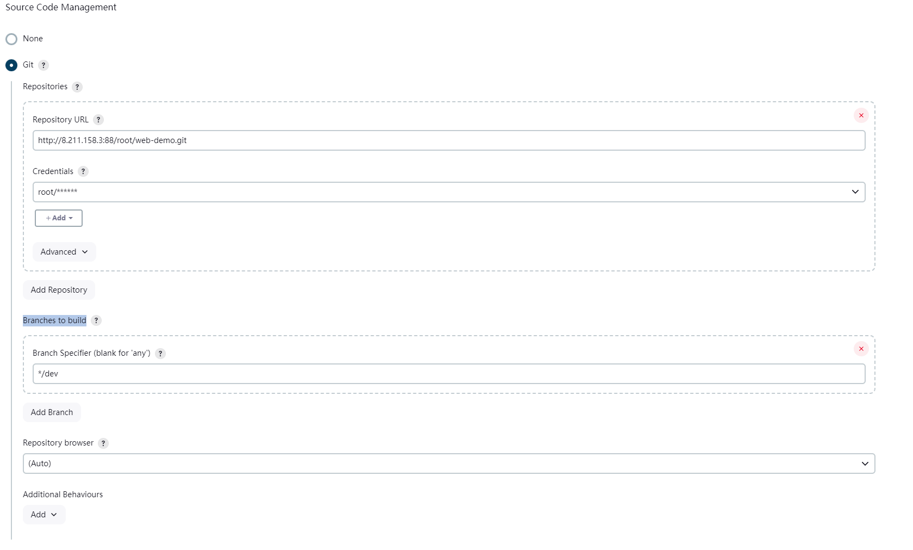
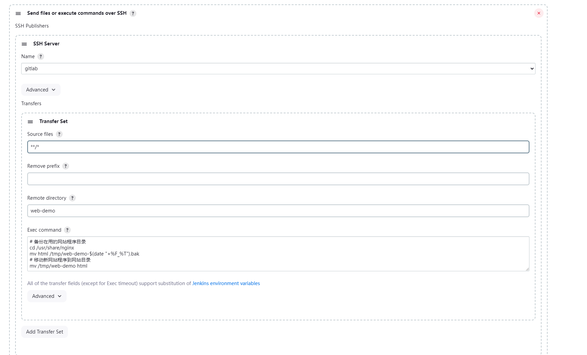

# Jenkins 流程构建

案例如下：
假设有一个 web 前端项目，希望每次代码发生变更时，能够自动触发构建流程并将最新的代码发布到目标服务器上，以便用户可以直接访问并体验新的页面内容。

## 创建项目

1. 在 GitLab 为 Web 项目创建一个仓库“web-demo”。
2. 将代码拉取到服务器，在 dev 分支创建一个简单的 index.html 文件后，推送代码即可。

## 安装 jenkins 插件

1. 安装插件 manage Jenkins => plugins => avaliable plugin,安装下列插件

   - Git : 在 jenkins 中集成 git.

## 配置触发器

这步的作用主要是设置拉取源代码的触发器，在满足条件下将源代码拉取到 jenkins 服务器

1. 进入 Jenkins 创建 Item,选择 Freestyle project.
2. Source Code Management 选择 git 方式管理源代码,

   - Repository URL: 填写 git 代码地址
   - Credentials：点击 add 创建账户密码登录方式，然后选择创建的用户凭证。
   - Branches to build： 指定构建的代码分支
     

3. Build Triggers 选择构建触发方式，这里选择 Poll SCM，定期轮询检查代码仓库中是否有新的提交，有则构建，Schedule 填写"\* \* \* \* \*" (cron 表达式)。

   - Trigger builds remotely (e.g., from scripts)：
   - Build after other projects are built:其他项目构建完成后触发构建
   - Build periodically:周期进行项目构建
   - Poll SCM:周期进行项目构建，但是会检查代码差异，无变化则不构建。

## 配置构建步骤

构建步骤主要任务是将获取的代码文件推送到 web 服务器上并将其部署。

- **这类需求可以使用 scp,rsync 等工具来实现，并在 Execute shell 中写入具体的脚本命令**。

- **还可以额外使用 Publish Over SSH 插件来实现**

这里使用 Publish Over SSH 插件实现，

1. 进入 manage Jenkins => plugins => avaliable plugin 安装 Publish Over SSH 插件
2. 进入 manage Jenkins => system => Publish Over SSH .单击 Add 添加服务器。
   
3. 进入构建步骤，选择 Send files or execute commands over SSH。
   
4. 完成后，修改 git 仓库代码并提交，待 jenkins 执行后，检查 web 服务器
   内容是否更新。
