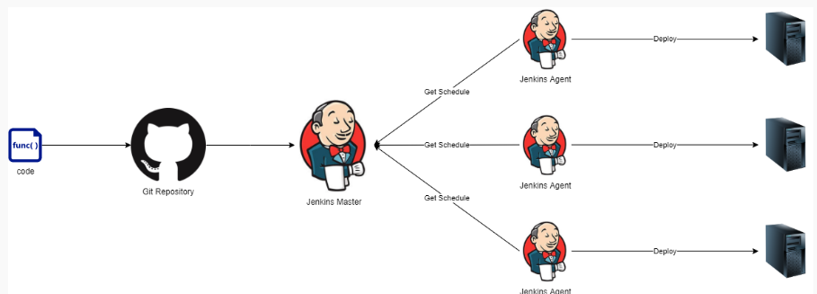
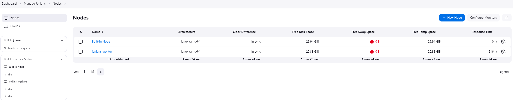
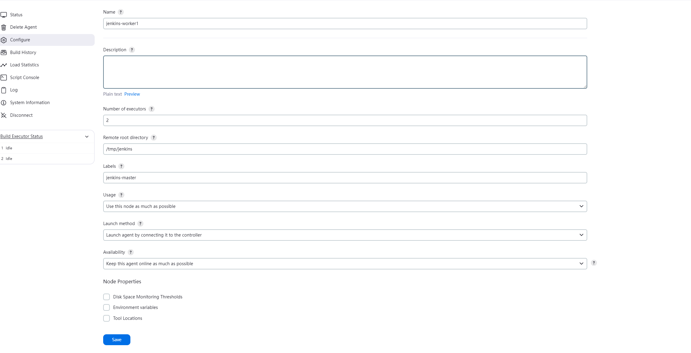
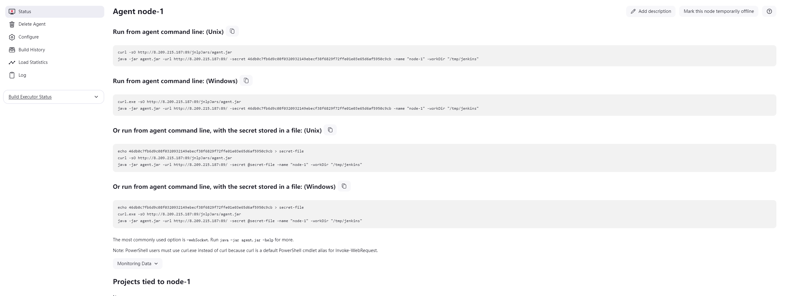
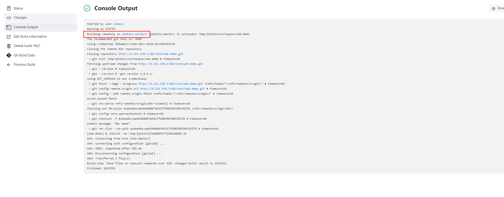

# jenkins 主从架构

Jenkins 主从架构是一种分布式架构，主节点负责管理里项目配置、任务调度和监控，从节点负责执行具体的构建任务。

当项目触发构建时，主节点将任务分配到某个从节点，从节点根据项目配置执行一些列操作，如拉取代码、代码编译、部署到目标服务器等。这种方式可以将构建过程中产生的负载有效的分散到各个从节点上，从而减轻主节点的负担，尤其是在多个项目同时构建的情况下。

## 添加从节点

- Launch method 使用命令行访问方式

  该方式使用命令行控制从节点的启动，服务器后会关闭

  1. 创建从节点

     进入 manage Jenkins => Nodes => + New Node
     
     

     - Number of executors: 并发执行数量
     - Remote root directory: jenkins 工作空间
     - Launch method: 主节点访问从节点的方式

  2. 启动从节点

     保存后配置后，会提示如何使用命令启动从节点。
     
     进入从节点服务器，安装 jdk 环境,执行 jenkins 提示的文件

  3. 测试

     开始一个 jenkins 流程，查看日志记录，看流程是否执行在从节点上。
     

- Launch method 使用 SSH 访问方式（TODO）

  创建公私密钥的默认位置
  非 root 用户创建公司密钥的默认位置。
  公司密钥是否和用户挂钩

  1. 安装插件 SSH Build Agents plugin,使得 Launch method 支持 ssh 访问
  2. 为主节点访问从节点做准备

     1. 创建公私密钥
     2. 公私密钥添加到 jenkins 凭证
     3. 安装 jdk 环境

  3. 创建从节点
  4. 测试
