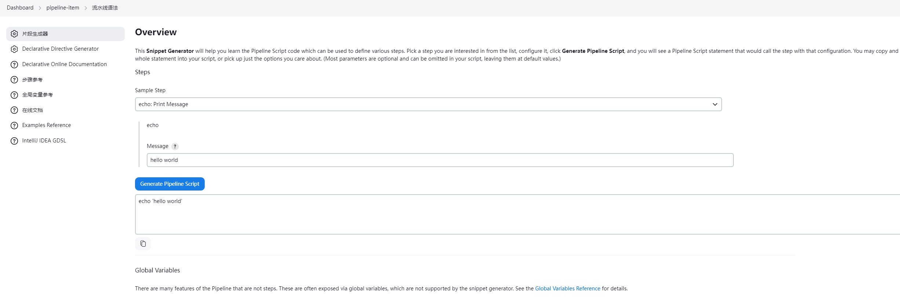
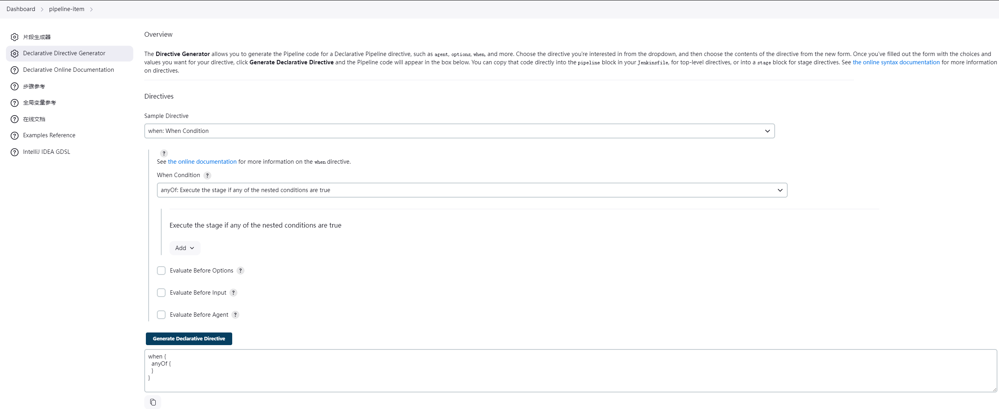

# Pipeline

Jenkins 提供了 Pipeline 项目类型（又称流水线）。Pipeline 项目类型为用户提供了更灵活、强大且可编程的 CI/CD 流程。

## Pipeline 语法

声明式语法风格是 jenkins 后来引入的，它注重以简介、直观的编程风格来表达意图。语法结构如下

```Groovy
    pipeline {
        agent any
        stages {
            stage('Stage 1') {
                steps {
                    echo 'Hello world!'
                }
            }
            stage('Stage 2') {
                steps {
                //    构建
                }
            }
        }
    }
```

- agent :

  指定运行的节点。"any"表示可以在任何可用的节点上执行。

- stages:

  指定构建流程中的阶段（stage）,它可以包含一个或多个阶段，这些阶段会按照定义的顺序从上向下依次执行。

- stage:

  定义具体的阶段，每个阶段代表一个逻辑分段，它可以包含一个或多个步骤（steps）,会按照定义顺序从上向下依次执行。

- steps:

  定义执行的具体步骤，如编译代码、执行命令等。

## Pipeline 片段生成器

jenkins 提供了 Pipeline 片段生成器帮助用户快速生成 Pipeline 脚本代码

进入某个流水线项目后如下所示


1. Sample Step 选择需要的功能
2. 根据提示编写命令
3. 点击 Generate Pipeline Script 后生成脚本代码。

jenkins 还提供了一个专门为声明式语法风格设计的生成器，名为"Declarative Directive Generator（声明式指令生成器）”，主要用于生成 Pipeline 指令的代码片段，如下图

