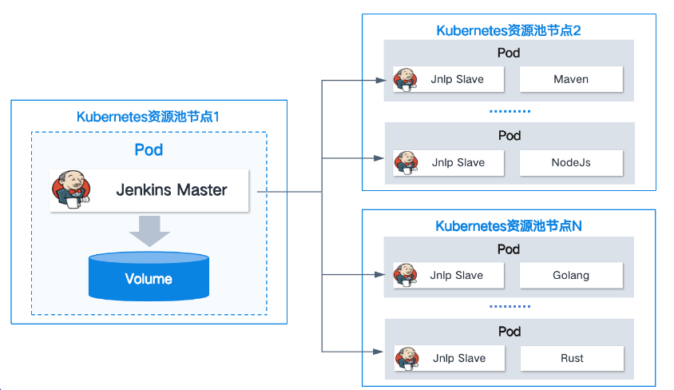

# 基于 k8s 动态创建代理

Jenkins 支持基于 K8s 动态创建代理，使代理程序能够运行在 Pod 中。这种方式可以根据构建任务动态的增减代理。充分利用 k8s 的特性，为分布式构建提供灵活的运行环境。

当项目触发构建时，Jenkins 会调用 k8s API 创建一个专用的 Pod 作为从节点，在该 Pod 创建一系列构建任务，**一旦完成构建流程，该 Pod 就会自动销毁，实现资源的高效利用**。

## 实例演示（TODO）

1. jenkins 安装插件 Kubernetes
2. jenkins 添加看 k8s 云，进入 manage Jenkins => Clouds => New cloud。
   - Kubernetes 地址： 指定 k8s API 地址和端口（它们通常是 k8s Master 节点 IP 地址和 6443 端口）,并使用 HTTPS 协议。
   - 凭据： 选择访问 k8s API 的凭据。
   - Jenkins 地址： 指定 jenkins 访问地址。
3. jenkins 创建 Pipeline 类型项目
