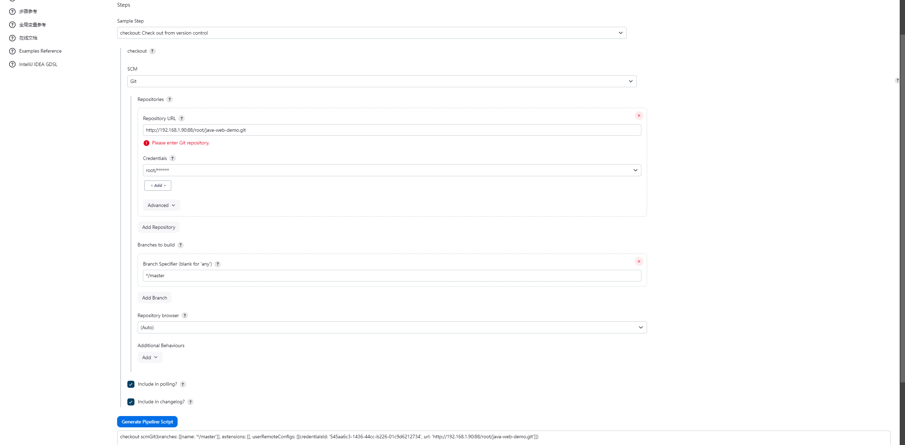
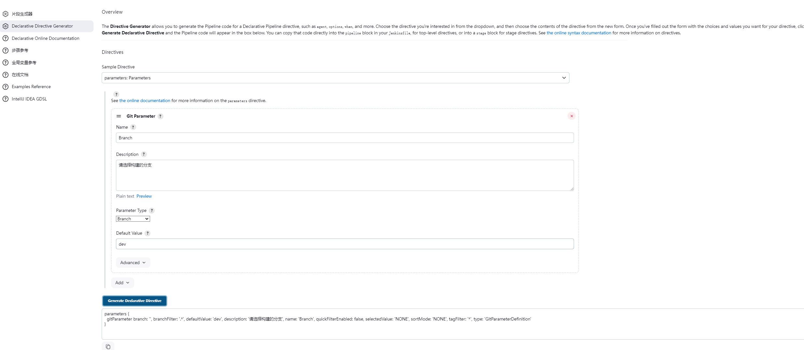

# Pipeline 项目实例（TODO）

git 项目更新并推送项目到仓库后，自动触发 Pipeline 流水线，并执行邮件通知脚本。
Pipeline 流水线脚本的构建过程分别为：

1. 拉取代码
   1. 从代码库拉取最新代码
   2. 根据选择的分支拉取对应的代码版本
2. 代码编译
   1. 执行代码编译的工作
   2. 生成可部署的文件
3. 构建镜像
   1. 编写 Dockerfile
   2. 构建镜像
   3. 推送镜像到镜像仓库
4. 部署到 k8s 集群
   1. 编写资源配置
   2. kubectl 执行部署和更新操作
5. 信息反馈用户
   1. 发送邮件告知相关负责人执行结果

Pipeline 脚本基本架构如下:

```jenkins
pipeline {
    agent {
        kubernetes {
            yaml '''
                apiVersion: v1
                kind: Pod
                spec:
                    containers:
                        - name: jnlp
                        image: jenkins/inbound-agent:latest
                        args: ['\$(JENKINS_SECRET)','\$(JENKINS_NAME)']
            '''
        }
    }
    stages {
        stage('拉取代码') {
            steps {
                echo '拉取代码'
            }
        }
        stage('代码编译') {
            steps {
             echo '拉取代码'
            }
        }
        stage('构建镜像') {
            steps {
             echo '拉取代码'
            }
        }
        stage('部署集群') {
            steps {
             echo '拉取代码'
            }
        }
    }
    post {
        always {
            echo '构建完成'
        }
        success {
            echo '构建成功'
        }
        failure {
            echo '构建失败'
        }
    }
}


```

## 拉取代码阶段

假设我们已经存在一个 git 项目，仓库地址为 'http://192.168.1.90:88/root/java-web-demo.git'，可以通过代码片段生成器创建。


为了能够动态切换分支，我们这里使用 Git Paramster,该 Paramster 由“Git Paramster”插件提供。之后使用代码片段生成器创建。



将之前生成的 git 获取代码脚本中的 scmGit 中的分支名成设置为“${params.Bransh}”。得到最终脚本为如下

```Groovy
  parameters {
      gitParameter branch: '', branchFilter: '.*', defaultValue: 'dev', description: '请选择构建的分支', name: 'Branch', quickFilterEnabled: false, selectedValue: 'NONE', sortMode: 'NONE', tagFilter: '*', type: 'GitParameterDefinition'
  }
  stages {
      stage('拉取代码') {
          steps {
              checkout scmGit(branches: [[name: '${params.Bransh}']], extensions: [], userRemoteConfigs: [[credentialsId: '545aa6c3-1436-44cc-b226-01c9d6212734', url: 'http://192.168.1.90:88/root/java-web-demo.git']])
          }
      }
  }
```

## 代码编译阶段

## 构建镜像阶段

## 部署到集群阶段

## 反馈阶段

## 准备

- 确保 jenkins 安装了 Pipeline 插件
- 确保 jenkins 安装了 github 插件
- 准备一个 github 项目，如 web-demo

## 创建 git 的 webhook（TODO）

1. 进入 github 创建 webhook，在指定仓库的 Setting=>webhooks 中新增 webhook,`Payload URL`填写内容`http://{jenkins域名:端口}/github-webhook/`并保存。

## 创建流水线

1. 在指定流水线配置中构建触发器选项勾选 `GitHub hook trigger for GITScm polling`
2. 在指定流水线配置中流水线选项中写入 github 仓库信息。_jenkins 会根据 webhook 中提供的仓库名称查找对应的仓库流水线_

   - `定义`:`Pipeline script from SCM`,
   - `SCM`:`Git`
   - `Repository URL` :git 项目地址
   - `Credentials`:添加 git token 凭证，

     - 凭证类型:`Secret text`
     - Secret : git Token 凭证

     _git token 凭证 github 中 setting=>Developer Settings=>Personal access tokens=>Tokens 中新建_

   - `Branches to build` :需要构建的分支

   **此时已经完成了 git 推送触发流水线的工作，接下来是触发邮件脚本通知**

- 指定邮箱开启 STMP 服务，并获取凭证
- jenkins 添加邮件发送插件`Email Extension Plugin`
- 进入 jenkins 系统设置下的`Extended E-mail Notification`,填写邮箱信息
  - SMTP server：smtp.{邮件后缀}.com
  - SMTP Port：587
  - 高级选项添加 STMP 凭证
    - 类型：用户名和密码
    - 用户名：邮箱地址
    - 密码：STMP 提供的凭证
  - useSSL: true
- 进入 github 项目根目录创建 Jenkinsfile 脚本文件，内容如下

  ```
      pipeline {
          agent any
          stages {
              stage('Hello') {
              steps {
              mail bcc: '', body: '这里是', cc: '', from: '', replyTo: '', subject: '异常推送', to: '1093872843@qq.com'
              }
          }
          }
      }

  ```

3. 流程出错时，通知用户
