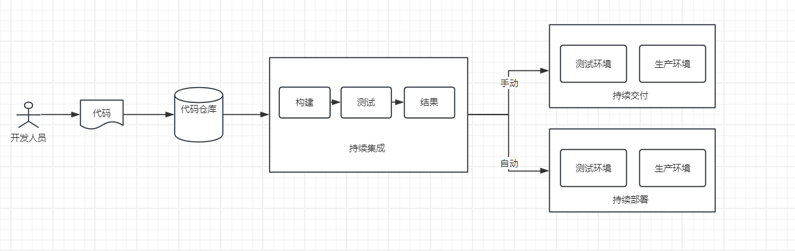

# 什么是 CI/CD

CI(持续集成)/CD(持续交付或持续部署)是软件开发中的一种重要实践和方法。

## CI(持续集成)

在开发过程中，代码更新后，需要提交到代码仓库。为了保证合并后代码的正确性，通常会进行一次编译，单元测试，集成测试来验证代码的可用性。这个过程每天可能发生一次或多次，如果每次都需要手动来做，效率太低了。

因此，建立自动化的集成流程是提高工作效率的重要手段。提交代码后，它会自动触发编译，单元测试，部署等操作，如果在这个集成过程中发现了问题，如编译失败，将通知开发人员，让他们及时修复问题。这个过程称为持续集成。

持续集成的核心在于频繁的代码合并和单元测试，快速反馈集成结果。

## CD(持续交付/持续部署)

持续交付是持续集成的下一个阶段，本身是包括了持续集成的，每次提交通过测试后，系统会自动将应用部署到类似生产环境的预生产环境中。确保所有通过测试的代码始终处于可以发布的状态。虽然它不会自动将代码部署到生产环境，但开发团队可以随时选择将最新的代码发布到生产环境。

