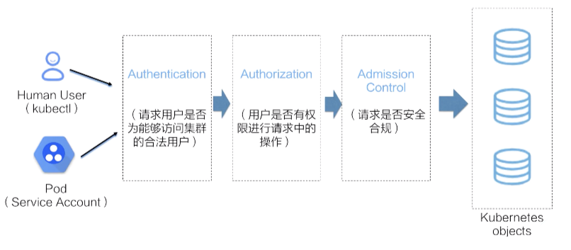
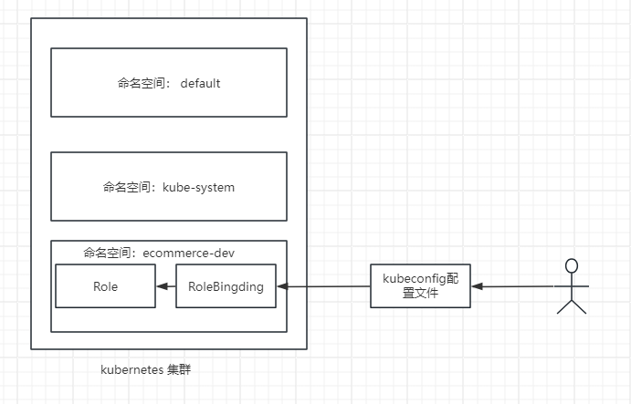

# Kubernetes 安全配置

Kubernetes 安全配置是确保在生产环境中维护集群和应用程序安全性的核心要素。这涵盖了多个方面，包括认证，授权，容器权限和网络策略等

## Kbernetes API 访问控制

API 访问控制是指通过对集群中的 API 资源进行权限管理，以确保只有被授权的用户才能执行特定的操作，从而提高集群的安全性和合规性。

当访 k8s 资源对象时，实际上是向 API Server 发送 API 请求，API Server 接受请求后，将进行一系列的安全验证，如下所示。



- Authentication(认证)

  验证用户身份合法性。支持多种认证，包括客户端证书（证书+私钥）,Token，用户名密码。

- Authorization（鉴权）

  检查用户是否拥有执行操作的权限。鉴权模式是通过 API Server 的启动参数“-authorization-mode”来指定的，该参数允许指定一个或多个鉴权模式，默认为“RBAC”

- Admission Control(准入控制)

  在请求通过认证和鉴权之后对该请求进行验证或修改。准入控制由多个插件组成，这些插件被内置在 APIServer 组件中，并通过 API Server 的启动参数“--enable-admission-plugins”来启动和关闭。你可以通过“kube-apiserver --h|grep enable-admission-plugins”命令查看支持的插件列表

### RBAC 介绍

RBAC(role-based access control 基于角色的访问控制)是一种权限管理方法。通过将权限赋予角色，再将角色分配给用户，RBAC 实现了对用户访问权限的管理。k8s 默认使用 RABC 作为鉴权模式来控制用户对资源的访问权限。

k8s RBAC 支持多种维度来定义和分配权限，包括

- 用户（User）

  基于用户授权，允许对不同用户分配权限。

- 用户组（Group）:

  基于用户组授权，允许对用户组分配权限

- 资源（Resource）:

  授权访问的资源类型（Pod，Deployment，Service）,允许给一个或多个资源分配权限。

- 资源操作方法（Method）:

  授权对资源类型的操作方法，包括 get,list,create,update,patch,watch,delete,允许对每个资源类型分配不同的操作方法

- 命名空间（Namespace）:

  基于命名空间授权，允许对某个命名空间或者所有命名空间分配权限

- API 组（API Group）

  基于 Kubernetes API 组授权，允许对不同的 API 组分配权限。

RABC 由 以下四个主要资源对象组成。

- Role(角色)

  一组权限规则，定义对特定命名空间中的资源操作权限。

- ClusterRole(集群角色)

  类似于角色，但它的作用于整个集群而不是单个命名空间。

- RoleBinding(角色绑定)

  将用户，组或服务账号与角色或集群角色关联。

- ClusterRoleBinding(集群角色绑定)
- 将用户，组或服务账号与集群角色关联。

#### 案例 1

一个 k8s 集群为多个部门服务，并根据部门划分了不同的命名空间。负责电商的开发部门，命名空间为“ecommerce-dev”。为了提高集群的安全性，仅允许部门成员访问相应命名空间中的资源。如下图。



1. 生成客户端证书

   k8s 集群自带一个自签名的根证书颁发机构（CA）。CA 的“ca.crt”和“ca.key”文件位于“/etc/kubernetes/pki”目录下/。这里使用 cfssl 证书管理工具。

   配置 ca 文件信息如下

   ```JSON
   //   ca-config.json
   {
    "signing": {
        "default": {
            "expiry": "87600h" // 过期时间
        },
        "profiles": {
            "kubernetes": {
                "expiry": "87600h",
                "usages": [ //定义证书的用途
                    "signing",  //签名
                    "key encipherment", // 密钥加密
                    "server auth",  // 服务端身份验
                    "client auth"   // 客户端身份验证
                ]
            }
        }
    }
   }
   ```

   配置 csr 信息如下

   ```JSON
   //   aliang-csr.json
   {
    "CN": "aliang", // 通用名称，可以设置任意字符串。
    "host": [], // 主机名或者IP地址列表，限制证书的适用范围、
    "key": { //指定密钥的算法和大小
        "algo": "rsa",
        "size": 2048
    },
    "names": [ // 证书的详细信息
        {
            "C": "CN", // 国家
            "ST": "Beijing", // 省
            "L": "Beijing", // 城市
            "O": "k8s", // 组织
            "OU": "System" //组织单位
        }
    ]
   }
   ```

   开始创建证书

   ```linux
    cfssl gencert -ca=/etc/kubernetes/pki/ca.crt -ca-key=/etc/kubernetes/pki/ca.key -config=ca-config.json -profile=kubernetes aliang-csr.json | cfssljson -bare aliang
   ```

   上述指定完成后，将在当前目录下生成 aliang.pem 和 aling-key.pem 文件

2. 创建 kubeconfig 配置文件

   kubeconfig 文件用于配置 kubectl 工具与 Kubernetes 集群的通信。该文件包含了集群信息、用户凭证及命名空间设置等。在使用多个集群或上下文时，可以通过 kubeconfig 文件方便地切换。使用 kubectl 工具提供的 config 子命令来创建文件。

   ```linux
   # 配置集群信息
   kubectl config set-cluster kubernetes \
   --certificate-authority=/etc/kubernetes/pki/ca.crt \
   --embed-certs=true \
   --server=https://<api-server-url>:6443 \
   --kubeconfig=aliang.kubeconfig
   ```

   ```linux
   # 配置用户凭证
   kubectl config set-credentials aliang \
   --client-certificate=aliang.pem \
   --client-key=aliang-key.pem \
   --embed-certs=true \
   --kubeconfig=aliang.kubeconfig
   ```

   ```linux
   # 配置上下文，关联集群和用户
   kubectl config set-context kubernetes-aliang \
   --cluster=kubernetes \
   --user=aliang \
   --kubeconfig=aliang.kubeconfig
   ```

   ```linux
   # 设置当前上下文
   kubectl config use-context kubernetes-aliang --kubeconfig=aliang.kubeconfig
   ```

   上述命令执行结束后，会在当前目录下生成一个 aliang.kubeconfig 文件，通过该文件可以访问 k8s 集群，例如查看 Pod

   ```linux
   # 设置当前上下文
   kubectl --kubeconfig=aliang.kubeconfig get pods
   ```

   此时尚未对 aliang 用户授予任何权限，无法执行任何资源操作

3. 创建 Role

```yaml
# ecommerce-dev-role.yaml
apiVersion: rbac.authorization.k8s.io/v1
kind: Role
metadata:
  name: ecommerce-dev-role
  namespace: ecommerce-dev
rules:
  - apiGroups: ["", "apps"]
    resources:
      ["pods", "deployments", "services", "ingresses", "configmaps", "secrets"]
    verbs: ["*"]
  - apiGroups: [""]
    resources: ["persistentvolumeclaims"]
    verbs: ["get", "list", "create", "update"]
```

```linux
# 创建资源
kubectl apply -f ecommerce-dev-role.yaml
# 查看资源
kubectl get role -n ecommerce-dev
# 查看资源详情
kubectl describe role ecommerce-dev-role -n ecommerce-dev
```

4. 创建 RoleBinding

```yaml
# ecommerce-dev-role-aliang.yaml
apiVersion: rbac.authorization.k8s.io/v1
kind: RoleBinding
metadata:
  name: ecommerce-dev-role-aliang
  namespace: ecommerce-dev
subjects:
  - kind: User
    name: aliang # 这里是用户的名字
    apiGroup: rbac.authorization.k8s.io
roleRef:
  kind: Role
  name: ecommerce-dev-role # 这里是要绑定的Role名称
  apiGroup: rbac.authorization.k8s.io
```

```linux
# 创建资源
kubectl apply -f ecommerce-dev-role-aliang.yaml
# 查看资源
kubectl get roleBinding -n ecommerce-dev
```

此时用户已拥有 ecommerce-dev-role 角色所定义的权限。

#### 案例 2：

运维部门的阿龙需要熟悉集群中应用程序的部署情况，因此他需要授权可以查看所有命名空间的 Pod，deployment,Service 和 Ingress 资源的权限。

1. 同案例 1 步骤 1，将其中的 aling 修改为 along
2. 同案例 1 步骤 2，将其中的 aling 修改为 along
3. 创建 ClusterRole 和 ClusterRoleBinding 资源，并进行绑定。

```yaml
# deploy-reader-clusterrole.yaml
apiVersion: rbac.authorization.k8s.io/v1
kind: ClusterRole
metadata:
  name: deploy-reader
rules:
  - apiGroups: ["", "apps"]
    resources: ["pods", "deployments", "services", "ingresses"]
    verbs: ["get", "list", "watch"]

---
apiVersion: rbac.authorization.k8s.io/v1
kind: ClusterRoleBinding
metadata:
  name: deploy-reader-along
subjects:
  - kind: User
    name: along # 这里是用户的名字
    apiGroup: rbac.authorization.k8s.io
roleRef:
  kind: ClusterRole
  name: deploy-reader # 这里是要绑定的Role名称
  apiGroup: rbac.authorization.k8s.io
```

#### 内置集群角色

- cluster-admin

  集群管理员权限，拥有对整个集群的完全控制权限。

- admin

  管理员权限，拥有对整个集群的大多数资源管理权限，不允许船舰一些资源，如 Endpoints,Namespaces.

- view

  拥有对整个集群的大多数资源查看权限，不允许查看安全相关的资源，如 Role,RoleBinding,Secrets

- edit

  与 admin 类似，权限比 admin 少，不能查看和修改 Role,RoleBinding 等。

## Pod 安全上下文(securityContext)

容器上下文用于配置和控制 Pod 运行时的安全属性和限制，从而提供 Pod 的安全性。[Pod 安全性上下文选项](https://kubernetes.io/docs/reference/generated/kubernetes-api/v1.31/#podsecuritycontext-v1-core)

securityContext 可以配置在 Pod 层级或者容器层级。配置在 Pod 层级对 Pod 中的所有容器都会生效，在容器层级配置只会对该容器生效。

### 案例 1

以普通用户运行容器由两种方式可以实现，

1. 通过在 Dockerfile 文件中指定

   ```Dockerfile
    FROM <镜像>
    RUN useradd <用户名>
    # 构建容器的其他步骤
    USER <用户名>
    CMD <启动应用程序>
   ```

2. 通过配置 securityContext

```yaml
apiVersion: v1
kind: Pod
metadata:
  name: app-pod
spec:
  containers:
    - name: web
      image: nginx:1.23
      securityContext:
        runAsUser: 1000
        runAsGrouop: 1000
```

### 容器启用特权

容器启用特权，有些应用程序在容器中需要执行一些更高权限的操作，如访问宿主机的设备文件，修改内核参数，更改网络配置，为了确保顺利执行，需要启动容器特权。

```yaml
apiVersion: v1
kind: Pod
metadata:
  name: app-pod
spec:
  containers:
    - name: web
      image: nginx:1.23
      securityContext:
        privileged: true
```

### 容器设置只读文件系统

容器设置只读文件系统

```yaml
apiVersion: v1
kind: Pod
metadata:
  name: app-pod
spec:
  containers:
    - name: web
      image: nginx:1.23
      securityContext:
        readOnlyRootFilesystem: true
```

这意味着不能再容器中执行创建，更新和删除操作。

## 网络策略

k8s 使用命名空间实现了资源的隔离，但是并没有对网络进行隔离，这意味着任意命名空间的 Pod 可以进行自由通信。为了提高网络安全性，可以使用网络策略实现网络访问控制。

网络策略的实现依赖于网络插件（Calico,Cilium）

网络策略资源内容如下

```yaml
apiVersion: networking.k8s.io/v1
kind: NetworkPolicy
metadata:
  name: <名称>
  namespace: <命名空间>
spec:
  podSelector: <Object> # 应用该策略的Pod,使用标签选择器
  policyTypes: <[]string> # 策略类型，有ingress（入栈）和egress(出栈)，未指定默认ingress（入栈）
  ingress: <[]Object> 定义入栈流量的规则列表
  egress: <[]Object> 定义出栈流量的规则列表
```

### 案例 1：禁止所有 Pod 的入栈流量

命名空间 team-a 禁止所有 pod 入栈流量

```yaml
apiVersion: networking.k8s.io/v1
kind: NetworkPolicy
metadata:
  name: deny-ingress
  namespace: team-a
spec:
  podSelector: {}
  policyTypes:
    - Ingress
```

podSelector 为“{}”表示对当前应用空间中的所有 Pod 应用该网络策略。
policyTypes 为“Ingress”表示该网络策略仅限制入站流量，由于没有指定入站流量规则列表，则默认拒绝所有入栈流量。

### 案例 2: 限制特定 Pod 入栈访问

假设 team-b 命名空间部署了一个网站和一个数据库，网站 Pod 拥有标签“app=nginx”,
数据库 Pod 拥有标签“app-mysql”。为了提高数据库的安全性，限制数据库仅允许网站 Pod 访问它的 3306 端口，其他 Pod 不允许访问。

```yaml
apiVersion: networking.k8s.io/v1
kind: NetworkPolicy
metadata:
  name: web-to-db
  namespace: team-b
spec:
  podSelector:
    matchLabels:
      app: mysql # 仅应用于team-b命名空间中的含有app=mysql标签的Pod
  policyTypes: # 仅限制Ingress，不限制出栈流量
    - Ingress
    # - Egress
  ingress:
    - from:
        # - namespaceSelector: # 仅允许指定命名空间的Pod访问
        #     matchLabels:
        #      name: website-ns
        - podSelector: # 仅允许含有app=nginx标签的Pod访问
            matchLabels:
              app: nginx
        # - ipBlock: # 仅允许指定IP的Pod访问
        #     cidr: 192.168.2.0/24 # 仅允许来自IP地段“192.168.2.0/24”访问
      ports:
        - protocol: TCP
          port: 3306
  # egress:
  #   - to:
  #       - ipBlock: # 仅允许访问指定IP
  #           cidr: 192.168.2.0/24 # 仅允许访问IP地段“192.168.2.0/24”


```
