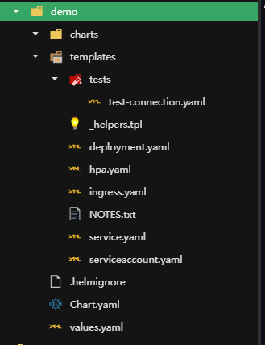

# Helm

通常部署应用程序时，我们使用“kubectl apply”资源文件命令在集群中创建资源。但是对于复杂的应用程序，尤其是微服务架构，可能会涉及数十个资源文件，这种方式就显得不够高效。此外，kubectl 还缺少应用级别的版本管理，例如只能回滚单个工作负载资源，而其他资源则无法回滚。为了解决这些问题，Helm 应运而生。

Helm 是一个 k8s 包管理工具，用于简化应用程序的部署和管理，并提供应用级别的版本管理。

Helm 使用一种称为“Chart”的打包格式组织和管理 K8s 资源文件。使用 Chart,可以轻松的共享和服用应用程序的资源配置，从而减少配置工作量。

## [Helm 安装](https://github.com/helm/helm/releases)

在 [Helm 项目](https://github.com/helm/helm/releases)中找到合适系统平台的软件安装包，下载到 Master 节点上,解压并放到系统的“Path”路径下

```linux
 tar zxvf helm-v3.16.1-linux-amd64.tar.gz

 mv linux-amd64/helm /usr/bin/

 helm --help
```

## Helm 基本使用

下面是一些常用的命令

- helm create

  创建一个新的 helm 模板

- helm install

  将 Chart 安装到到 k8s 集群当中

- helm upgrade

  对已部署的 Chart 进行升级

- helm rollback

  对指定 Release 回滚到之前的版本

- helm uninstall

  卸载 Release

### 制作 Chart

Chart 是一个预定义的目录结构，其中包含描述应用程序的 k8s 资源配置，配置参数，依赖关系及其其他相关文件。

```linux
helm create demo
```

这将生成如下目录文件



- charts 目录

  用于存放与当前 Chart 相关的子 Chart，可选。

- Chart.yaml

  用于描述 Chart 信息，如名称，版本，描述等。

- templates 目录

  主要用于存放 k8s 资源的模板文件。该目录下有三类文件。

  - 模板文件

    k8s 资源文件，如 Deployment，Service 等，这些文件使用 Go 模板语法，允许通过变量，表达式和函数来灵活定义资源结构和配置。

  - \_helpers.tpl

    存放 Helm 模板函数，该模板函数可以在模板文件中重复使用，以简化模板文件的编写，并提高可维护性。

  - NOTES.txt

    在安装或升级 Chart 后显示的提示和说明。

- values.yaml

  用于定义 Chart 的默认值，这些默认值通常在模板文件中引用。你可以在安装 Chart 时修改这些值，以灵活的改变应用程序的配置。

接下来根据应用需求创建一个新的 Chart 命名为[mychart](./demo/mychart)。

### 安装 Chart

#### 模拟渲染结果：

在安装 Chart 之前，有两种方式可以预览模板文件的渲染结果。

1. 使用 “helm template mychart” 命令进行本地渲染和输出。这个命令在 helm 客户端执行，不依赖于 k8s 集群，因此可以在任意主机上测试。

2. 使用“helm install web-nginx mychart --dry-run”命令模拟 Helm 安装操作并输出渲染结果，而不会实际执行安装。这个命令会发送模拟安装到 Kubernets API 中，因此需要在 K8s 集群环境中使用它

通过以上两个命令，你可以检查生成的资源配置是否符合预期。

#### 正式安装如下:

```linux
# 安装Chart到k8s的test命名空间中。
helm install web-nginx mychart -n test
```

安装 Chart 后，Helm 会保存与该安装相关的记录，这个纪录被称为 **“Release”**。每个 Release 代表了一个特定应用程序的部署。通过 Release,可以进行升级，回滚，删除等操作，上述“web-nginx”是 Release 名称。

```linux
# 查看Release
helm list -n test
```

```
# 查看Chart创建的资源对象
kubectl get pod,deploy,svc -n test
```

由此可见，在执行安装 Chart 时，Helm 会先将 Chart 中 的模板渲染为实际的 k8s 资源配置，然后与 k8s 交互。

#### 可复用性

由于资源配置中可能变化的值可以被提取定义到 values.yaml 中被模板文件引用并且这些值可以在在执行 helm 命令中被动态修改，这使得我们可以通过一个模板轻松实现多个应用程序的部署。

```linux
#  通过添加--set 参数来覆盖指定字段的默认值。
# helm install nginx mychart --set key1=value1,key2=value2 -n test

helm install nginx mychart --set image.repository=httpd -n test
```

```linux
#  通过添加-f 参数来指定引用的values.yaml。
helm install nginx mychart -f custom-values.yaml
```

### 更新 Chart

更新 web-nginx 的 Release 镜像版本从 1.20 版本更新到 1.21 版本，并将副本数从 1 个扩展到 3 个

```linux
helm upgrade web-nginx mychart --set replicaCount=3,image.repository=nginx,image.tag=1.21 -n test --description 版本更新描述
```

```linux
# 查看更新历史
 helm history web-nginx -n test
```

### 回滚 Chart

```linux
# 回滚到上一个版本
helm rollback web-nginx  -n test
```

```linux
回滚到指定REVISION版本
helm rollback web-nginx  1 -n test
```

```linux
查看指定版本号对应的资源配置
helm get manifest web-nginx --revision 1 -n test
```

### 卸载 Chart

卸载 Release 并清理与应用程序相关的资源。

```linux
helm uninstall web-nginx -n test
```

## [深入理解 Chart 模板](https://helm.sh/zh/docs/chart_template_guide/function_list/)

Helm 的核心在于模板引擎，它支持丰富的模板语法，包括变量，条件判断，循环，函数等,详情请看官网。

## 自建 Chart 仓库

在企业环境中，通常会搭建一个 Helm Chart 仓库，用于集中存储和共享 Chart,以便于其他 k8s 集群或团队成员使用这些 Chart。

[ChartMuseum](https://chartmuseum.com/docs/#docker-image) 是 Helm 开源的 Chart 仓库服务，支持多种后端存储，如 AWS S3，阿里云 OSS，腾讯云 COS 等。使用 ChartMuseum 来自 Chart 仓库服务器是一个不错的选择。

### Chart 仓库安装

以下是 ChartMuseum 的 docker 安装

```linux
docker run -d --name=chart-repository \
  -p 8080:8080 \
  -e DEBUG=1 \
  -e STORAGE=local \
  -e BASIC_AUTH_USER=admin \
  -e BASIC_AUTH_PASS=123456 \
  -e STORAGE_LOCAL_ROOTDIR=/charts \
  -v /opt/chart-repository:/charts \
  chartmuseum/chartmuseum:latest

```

假设主机 IP 是 192.168.1.90，浏览器访问 192.168.1.90:8080，输入上述设置的用户名密码即可看到 ChartMuseum 欢迎界面。

### 推送 Chart 仓库

1. 打包 Chart

   ```linux
     helm package mychart
   ```

2. 推送

   ```linux
     curl -u admin:123456 --data-binary "@mychart-0.1.0.tgz"  http://192.168.1.90:8080/api/charts
   ```

3. 拉取

   ```linux
   #  添加仓库地址
     helm repo add myrepo http://192.168.1.90:8080 --username=admin --password=123456
   ```

   ```linux
   # 查看本地仓库列表
   helm repo list
   ```

   ```linux
   # 安装指定Chart
   helm install web myrepo/mychart
   ```

## 公共 Chart 仓库

常见的公共 Chart 仓库如下

- [Helm 官方 Chart 仓库](https://charts.helm.sh/incubator/)
- [Bitnami Chart 仓库](https://charts.bitnami.com/bitnami)
- [Azure Chart 仓库](https://mirror.azure.cn/kubernetes/charts/)
- [阿里云 Chart 仓库](https: //kubernetes.oss-cn-hangzhou.aliyuncs.com/charts)

随着[Artifact Hub 平台]()的出现，上述公共 Chart 仓库的维护和更新逐渐减少，第三方 Chart 开始迁移到 Artifact Hub 平台上进行维护和分享。
