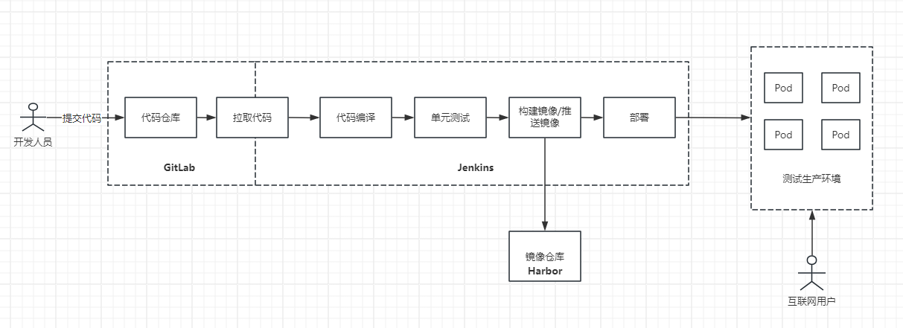
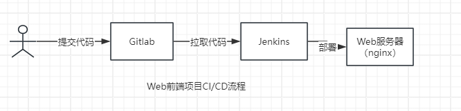
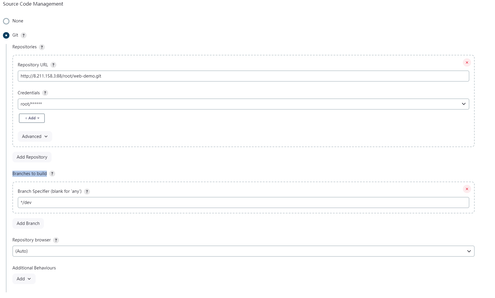

# 基于 Jenkins 的 CI/CD

## 什么是 CI/CD

CI(持续集成)/CD(持续交付或持续部署)是软件开发中的一种重要实践和方法。


### CI(持续集成)

在开发过程中，代码更新后，需要提交到代码仓库。为了保证合并后代码的正确性，通常会进行一次编译，单元测试，集成测试来验证代码的可用性。这个过程每天可能发生一次或多次，如果每次都需要手动来做，效率太低了。

因此，建立自动化的集成流程是提高工作效率的重要手段。提交代码后，它会自动触发编译，单元测试，部署等操作，如果在这个集成过程中发现了问题，如编译失败，将通知开发人员，让他们及时修复问题。这个过程称为持续集成。

持续集成的核心在于频繁的代码合并和单元测试，快速反馈集成结果。

### CD(持续交付/持续部署)

持续交付是持续集成的下一个阶段，本身是包括了持续集成的，每次提交通过测试后，系统会自动将应用部署到类似生产环境的预生产环境中。确保所有通过测试的代码始终处于可以发布的状态。虽然它不会自动将代码部署到生产环境，但开发团队可以随时选择将最新的代码发布到生产环境。

## CI/CD 实战

流程设计如下


### 部署 gitLab 代码仓库

使用 docker 容器化部署,假设主机 Ip 或域名为 192.168.1.90

```linux
docker run -d \
  --name gitlab \
  --hostname 192.168.1.90 \
  -p 443:443 \
  -p 88:80 \
  -p 2222:22 \
  --restart always \
  --volume /opt/gitlab/config:/etc/gitlab \
  --volume /opt/gitlab/logs:/var/log/gitlab \
  --volume /opt/gitlab/data:/var/opt/gitlab \
  gitlab/gitlab-ce:latest
```

安装完成后，访问 192.168.1.90:88,默认用户名为 root,密码系统随机生成，保存在“/etc/gitlab/initial_root_password”中，通过以下命令可以获取

```linux
docker exec gitlab cat /etc/gitlab/initial_root_password
```

## 部署 Harbor 镜像仓库

Harbor 是一个开源的容器镜像仓库，用于存储、签名和扫描容器镜像。它基于 Docker Registry，但在其基础上扩展了企业级功能，支持镜像的安全、管理和性能优化。Harbor 为容器环境中镜像的存储、管理和分发提供了更强大和安全的解决方案，尤其适合在企业级环境中使用。

1.  下载安装包

    在 [Harbor 项目](https://github.com/goharbor/harbor/releases)中下载 Harbor 安装包,文件名包含“offine”表示离线安装包，适合在没有网络的情况下部署。文件名包含“online”表示在线安装包，需要联网下载镜像。

    ```linux
     #解压
     tar zxvf harbor-offline-installer-v2.11.1.tgz

     #修改模板，
     cd harbor/
     cp harbor.yml.tmpl harbor.yml
     vi harbor.yml
    ```

    修改内容如下

    ```yml
    hostname: 192.168.1.90
    http:
      port: 80
    # https:
    #   port: 443
    #   certificate: /your/certificate/path
    #   private_key: /your/private/key/path
    #   strong_ssl_ciphers: false
    ```

    ```linux
    # 执行harbor初始化脚本，生成docker容器
    sh prepare
    sh install.sh
    ```

    浏览器访问 192.168.1.90 将看到登陆界面，默认初始账号为 admin,初始密码为 Harbor12345

## 部署 Jenkins

1. 使用 docker 容器化部署,假设主机 Ip 或域名为 192.168.1.90

   ```linux
   docker run -d \
   --name jenkins \
   -p 89:8080 -p 50000:50000 \
   --restart always \
   -v /opt/jenkins:/var/jenkins_home \
   jenkins/jenkins:lts
   ```

2. 将挂载的文件授权修改后,浏览器访问 192.168.1.90:89 将看到解锁 Jenkins，根据提示输入管理员密码

3. 选择【选择插件来安装】，进入后，取消勾选所有的插件点击完成。
4. 进入创建管理员用户页面。
5. 后续全部采用默认设置完成配置。
6. 进入首页。

## Jenkins 流程构建

案例如下：
假设有一个 web 前端项目，希望每次代码发生变更时，能够自动触发构建流程并将最新的代码发布到目标服务器上，以便用户可以直接访问并体验新的页面内容。



### 创建项目

1. 在 GitLab 为 Web 项目创建一个仓库“web-demo”。
2. 将代码拉取到服务器，在 dev 分支创建一个简单的 index.html 文件后，推送代码即可。

### 安装 jenkins 插件

1. 安装插件 manage Jenkins => plugins => avaliable plugin,安装下列插件

   - Git : 在 jenkins 中集成 git.

### 配置触发器

这步的作用主要是设置拉取源代码的触发器，在满足条件下将源代码拉取到 jenkins 服务器

1. 进入 Jenkins 创建 Item,选择 Freestyle project.
2. Source Code Management 选择 git 方式管理源代码,

   - Repository URL: 填写 git 代码地址
   - Credentials：点击 add 创建账户密码登录方式，然后选择创建的用户凭证。
   - Branches to build： 指定构建的代码分支
     

3. Build Triggers 选择构建触发方式，这里选择 Poll SCM，定期轮询检查代码仓库中是否有新的提交，有则构建，Schedule 填写"\* \* \* \* \*" (cron 表达式)。

   - Trigger builds remotely (e.g., from scripts)：
   - Build after other projects are built:其他项目构建完成后触发构建
   - Build periodically:周期进行项目构建
   - Poll SCM:周期进行项目构建，但是会检查代码差异，无变化则不构建。

### 配置构建步骤

构建步骤主要任务是将获取的代码文件推送到 web 服务器上并将其部署。

- **这类需求可以使用 scp,rsync 等工具来实现，并在 Execute shell 中写入具体的脚本命令**。

- **还可以额外使用 Publish Over SSH 插件来实现**

这里使用 Publish Over SSH 插件实现，

1. 进入 manage Jenkins => plugins => avaliable plugin 安装 Publish Over SSH 插件
2. 进入 manage Jenkins => system => Publish Over SSH .单击 Add 添加服务器。
   
3. 进入构建步骤，选择 Send files or execute commands over SSH。
   
4. 完成后，修改 git 仓库代码并提交，待 jenkins 执行后，检查 web 服务器
   内容是否更新。
