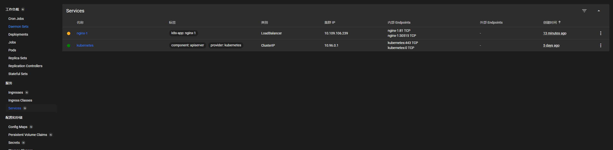

# 部署第一个应用

## 通过可视化管理部署应用程序

1. 这里点击右上角 + ，选择从表单创建，并输入下列内容
   
2. 进入 Pods 页面，可以看到创建了三个资源如下
   
3. 进入 Service,可以看到创建的 nginx 服务对外暴露的端口，通过访问 http://<服务器 IP>:30515/可以看到 nginx 页面

   _云服务器记得关闭防火墙_
   

## 通过 Kubectl 命令行部署应用程序

1. 创建 Deployment 资源并设置 3 个 Pod 副本

   ```linux
    kubectl create deployment nginx-2 --image=nginx:1.23 --replicas=3

    // Deployment名称为nginx-2
    // --image=nginx:1.23  镜像使用 nginx:1.23
    // --replicas=3  创建三个Pod

   ```

2. 创建 Service 资源

   ```linux
   kubectl create service nodeport nginx-2 --tcp=80:80

    // 服务类型为 NodePort
    // nginx-2 需要与Deployment对应
    // --tcp=80:80 端口映射，左侧代表 NodePort 服务监听的端口，右侧代表目标Pod内部端口

   ```

   _创建 NodePort 类型的服务后，可以通过以下方式访问应用：
   http://\<NodeIP>:\<NodePort>，其中 \<NodeIP> 是集群中任一节点的 IP 地址，\<NodePort> 是服务被分配的端口号。_

3. 查看创建的 service

   ```linux
   kubectl get service

   //通过访问 http://<服务器IP>:<PORT>/可以看到 nginx 页面
   ```

## 通过定义资源文件部署应用程序（YAML 格式文件）

1. 创建文件 deployment.yaml 如下

```yaml
apiVersion: apps/v1 # API版本
kind: Deployment # 资源类型
metadata: # 资源元数据
  name: nginx-3 # 资源名称
spec: #资源规格
  replicas: 3 #pod副本数量
  selector: #标签选择器
    matchLabels: #选择标签,与下面Pod标签保持一致
      app: nginx-3
  template: #定义模板
    metadata: #pod元数据
      labels: # pod标签，与上面选择的标签保持一致
        app: nginx-3
    spec: #pod规格
      containers: # Pod容器配置
        - name: web #容器名称
          image: nginx:1.23 #容器镜像名称
```

2. 根据资源文件创建 Deployment

   ```linux
   kubectl create -f deployment.yaml
   ```

3. 查看创建的 pod 和 deployment

   ```linux
   kubectl get deployment,pods
   ```

4. 创建 service.yaml 文件如下

```yaml
apiVersion: v1
kind: Service
metadata:
  name: nginx-3
spec:
  selector:
    app: nginx-3
  ports:
    - name: http
      protocol: TCP
      port: 80
      targetPort: 80
  type: NodePort
```

5. 创建 service 资源

   ```linux
   kubectl create -f service.yaml
   ```

6. 查看创建的 service

   ```linux
   kubectl get service
   ```
