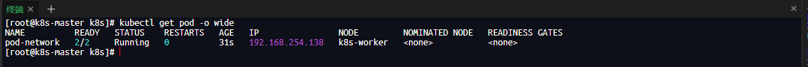

# Pod 资源对象

## 什么是 Pod

Pod 是 Kubernetes 中最小的调度单元,一个 Pod 可以包含一个或多个容器，这些容器运行在同一个节点，从而**可以共享网络，存储以及其他资源**。

Pod 是一个逻辑概念，不是一个隔离的环境。引入 Pod 目的是满足容器之间“密切协作关系”所需的环境，尤其是网络通信和文件共享的需求。

## 创建 Pod

这里我们创建一个 Pod，内部包含两个容器，一个 nginx 服务和一个 centos 系统

```yaml
apiVersion: v1
kind: Pod
metadata:
  name: pod-network
  labels:
    app: pod-network
  namespace: default
spec:
  containers:
    - name: web
      image: nginx:1.23
    - image: centos:7
      name: collect
      command: ["/bin/bash", "-c", "while true; do sleep 1; done"]
```

- 通过 yaml 文件创建 Pod 资源

  1. 创建内容如上的 pod-network.yaml 文件
  2. 执行创建命令

     ```linux
     kubectl create -f pod-network.yaml
     ```

- 查看 Pod

  ```linux
  kubectl get pod -o wide
  ```

  结果如下

  

- **NAME**: pod 名称
- **READY**: 2/2 标识该 Pod 中左侧的 2 正在运行的容器数量，右侧的 2 标识总计容器数量
- **STATUS**: Pod 运行状态
- **AGE**: 以运行时间
- **IP**: 内部 IP 地址,这个 IP 地址用于在 Kubernetes 集群内部进行通信。它不是外部可访问的地址，仅在集群内部有效。
- **NODE**: Pod 容器所在 Node（本例中共两个 Node,k8s-master 和 k8s-worker）

可以看到我们创建的 pod 在 k8s-worker 节点上，**进入 pod 所在节点**并执行 docker 命令查看容器

```linux
docker ps|grep pod-network
```


通过 k8s-master 创建的 pod 被自动部署到了其他服务器上，并且可以使用相关的容器工具正常访问。

返回 k8s-master 节点，分别执行以下命令

```linux
#进入web容器内部
kubectl exec -it pod-network -c web -- bash

curl  http://127.0.0.1
```

```linux
#进入collect容器内部
kubectl exec -it pod-network -c collect -- bash

curl  http://127.0.0.1
```

通过上述命令，我们发现可以在以下两点：

1. 管理节点也可以直接访问工作节点的 Pod 内容的。
2. 无论是进入 Pod 中哪个容器，都能访问到 Pod 的 nginx 容器 ，说明同一个 Pod 下，容器网络是互通的

## Pod 容器之间文件共享

Pod 可以配置 Volume(卷)实现数据共享。也就是说，当创建一个 Pod 时，Kubernetes 首先在 Pod 所在节点的文件系统上创建一个空目录，然后将该目录挂载到 Pod 内多个容器的日志目录中。

```yaml
apiVersion: v1
kind: Pod
metadata:
  name: pod-volume
  labels:
    app: pod-volume
  namespace: default
spec:
  containers:
    - name: web
      image: nginx:1.23
      volumeMounts:
        - name: log
          mountPath: /var/log/nginx
    - image: centos:7
      name: collect
      command: ["/bin/bash", "-c", "while true; do sleep 1; done"]
      volumeMounts:
        - name: log
          mountPath: /var/log/nginx
  volumes:
    - name: log
      emptyDir: {}
```

- 通过 yaml 文件创建 Pod 资源

  1. 创建内容如上的 pod-volume.yaml 文件
  2. 执行创建命令

     ```linux
     kubectl create -f pod-volume.yaml
     ```

  3. 查看创建内容

     ```linux
     kubectl get pod -o wide -l app=pod-volume
     ```

  4. 修改共享文件，验证文件被容器共享

     ```linux
     # 进入web容器在共享文件夹下创建新文件file.log
      kubectl exec -it pod-volume -c web -- bash

      cd /var/log/nginx

      touch file.log

     ```

     ```linux
      # 进入collect容器验证file.log文件是否已经存在
       kubectl exec -it pod-volume -c collect -- bash

       ls /var/log/nginx

     ```

## 管理 Pod 常用命令

- 创建一个 Pod

  ```linux
    kubectl run <Pod 名称> --image=<容器镜像地址>
  ```

- 查看当前命名空间中的 Pod 对象

  ```linux
    kubectl get pods
  ```

- 查看指定命名空间中的 Pod 对象

  ```linux
    kubectl get pods -n <命名空间>
  ```

- 查看所有命名空间中的 Pod 对象

  ```linux
    kubectl get pods -A
  ```

- 查看 Pod 日志，默认来自第一个容器

  ```linux
    kubectl logs <Pod 名称>
  ```

- 查看 Pod 中指定容器的日志

  ```linux
    kubectl logs <Pod 名称> -c <容器名称>
  ```

- 在 Pod 容器中执行命令，默认为第一个容器

  ```linux
    kubectl exec -it <Pod 名称> -- [执行命令]
  ```

- 在 Pod 指定的容器中执行命令

  ```linux
    kubectl exec -it <Pod 名称> -c <容器名称> -- [执行命令]
  ```

- 在 Pod 中启动一个交互式 Bash 终端，默认为第一个容器

  ```linux
    kubectl exec -it <Pod 名称> -- bash
  ```

- 在 Pod 指定的容器中启动一个交互式 Bash 终端

  ```linux
    kubectl exec -it <Pod 名称> -c <容器名称> -- bash
  ```

- 删除 Pod 对象

  ```linux
    kubectl delete pod <Pod 名称>
  ```

  _由 deployment 管理的 Pod 直接通过上述命令删除后，会自动重启一个新的 Pod 以确保副本数量,必须通过 deployment 操作_

- 删除当前命名空间中的所有 Pod 对象

  ```linux
    kubectl delete pod --all
  ```

## Pod yaml 常见配置字段及其值

```yaml
apiVersion: v1  # API版本
kind: Pod   # 资源类型
metadata: <object> # 资源元数据
  name: <string>   # Pod名称
  labels:          # Pod标签
    app: <string>
  namespace: <string> # 指定命名空间
spec:
  initContainers: <[]object> # 初始化容器列表
  containers: <[]object> # Pod中的容器列表
    - name: <string>   # 容器名称
      image: <string> # 镜像地址
      imagePullPolicy: <string> # 镜像下载策略
      command: <[]string> #启动执行命令
      args: <[]string> # entrypoint 参数
      port: <[]object> # 容器公开的端口
      env: <[]object> # 环境变量
      resources: <object> # 容器所需的计算资源
      livenessProbe: <object> # 存活探针
      readinessProbe: <object> # 就绪探针
      startupProbe: <object> # 启动探针
      volumeMounts:  <[]object> #卷挂载
      securityContext: <object> # 安全上下文
      lifecycle: <object> # 容器生命周期回调
  volumes: <[]object> #卷来源

```

- commamd

  用于定义容器启动时要执行的命令，并覆盖镜像中默认的启动命令，它的值是一个字符串列表类型。其中第一个元素视为命令名称，后续元素视为命令参数。

  ```yaml
  command: ["echo", "hello,world"]
  ```

  ```yaml
  command: ["/bin/sh", "-c", "while true；do sleep 1; done"]
  ```

- args

  用于指定容器启动时的命令参数，它的值是一个字符串列表类型，每个值被视为"command"的一个参数

  ```yaml
  command: ["echo"]
  args: ["hello", "world"]
  ```

- imagePullPolicy

  设置镜像拉取策略，有以下值

  - Always: 默认值，始终从镜像仓库拉取最新镜像
  - IfNotPresent: 优先使用节点上的镜像，如果不存在，则从镜像拉取。
  - Never: 仅使用节点上的镜像，不存在则报错。

- ports

  定义容器公开的端口列表，该字段的值是一个对象列表类型。包括以下内容

  - name: 端口名称
  - containerPort: 容器端口，即容器内应用程序监听的端口
  - protocol: 端口使用协议，支持 TCP,UDP 和 SCTP,默认 TCP

  ```yaml
  ports:
    - containerPort: 80
  ```

  上述定义了容器内应用程序使用 80 端口，

### 探针

- livenessProbe（存活探针）

  周期性检查检查应用程序的健康状态,检查容器中的应用程序是否运行。如果存活探针失败，Kubernetes 将重新启动容器，以尝试恢复应用程序的运行状态。

  创建一个存活探针实例如下

  _kubelet 将在容器启动后 10s 发送第一个探针，该探针向“http://\<Pod IP>:80/index.html”发送一个 HTTP 请求，如果响应的 HTTP 状态码不是 200~400,则判定探针失败，触发重新启动重启，随后，每 20s 执行一次存活探针。_

  ```yaml
  apiVersion: v1
  kind: Pod
  metadata:
    labels:
      app: pod-liveness
    name: pod-liveness
  spec:
    containers:
      - name: web
        image: nginx:1.23
        livenessProbe:
          httpGet:
            path: /index.html # 访问路径，默认是"/"
            port: 80 #请求端口
            # host:  #请求IP地址 ，默认是Pod IP
            # scheme:  请求协议，支持HTTP和HTTPS,默认是是HTTP
            # httpHeaders: 自定义HTTP头
          initialDelaySeconds: 10 # 容器启动后等待多久开始执行探针
          periodSeconds: 20 # 探针执行时间间隔（s）
  ```

  ```linux
    kubectl apply -f pod-liveness.yaml

    # 执行成功后，10s后通过日志可以查看探针请求日志，探针成功请求
    kubectl logs pod-liveness

    # 删除文件，手动制造错误观察探针
    kubectl exec -it pod-liveness -- rm -rf /usr/share/nginx/html/index.html

    # 20s后再次查看日志，发现探针失败
    kubectl logs pod-liveness

    # 查看Pod详情，可以发现Pod被重启。重启后，删除的文件被恢复。
    kubectl describe pod pod-liveness

    # Pod对象中可以查看重启次数 [RESTARTS]
    kubectl get pods -l app=pod-liveness
  ```

- readinessProbe（就绪探针）

  周期性检查检查应用程序的健康状态，检查应用程序是否准备好接收流量。如果就绪探针失败，Kubernetes 将 Pod 标记为“未准备就绪”，从而防止将新的流量转发到该 Pod

  创建一个就绪探针实例如下

  _kubelet 将在容器启动后 10s 发送第一个探针，该探针向“http://\<Pod IP>:80/index.html”发送一个 HTTP 请求，如果响应的 HTTP 状态码不是 200~400,则判定探针失败，将 Pod 标记为“未准备就绪”，随后，每 20s 执行一次存活探针。_

  ```yaml
  apiVersion: v1
  kind: Pod
  metadata:
    labels:
      app: pod-readiness
    name: pod-readiness
  spec:
    containers:
      - name: web
        image: nginx:1.23
        readinessProbe:
          httpGet:
            path: /index.html # 访问路径，默认是"/"
            port: 80 #请求端口
            # host:  #请求IP地址 ，默认是Pod IP
            # scheme:  请求协议，支持HTTP和HTTPS,默认是是HTTP
            # httpHeaders: 自定义HTTP头
          initialDelaySeconds: 10 # 容器启动后等待多久开始执行探针
          periodSeconds: 20 # 探针执行时间间隔（s）
  ```

  ```linux
  # 创建Pod资源
  kubectl apply -f pod-readiness.yaml

  # 为Pod创建一个Service
  kubectl expose pod pod-readiness --port=80 --target-port=80

  # 查看Service IP地址，[ClusterIP] 表示集群内节点可以访问该Pod的地址
  kubectl get service

  # 查看Endpoints对象，确认Service后端关联的Pod。[Endpoints ]表示外部可以访问该Pod的地址
  kubectl get endpoints

  # 删除文件，手动制造错误观察探针
  kubectl exec -it pod-readiness -- rm -rf /usr/share/nginx/html/index.html

  #20s后再次查看Endpoints对象,pod-readiness的Endpoints对象数据被移除，表示Service停止为该Pod转发流量，直到探针再次执行成功为止。
  kubectl get endpoints
  ```

- startupProbe（启动探针）

  检查容器中应用程序是否启动，它仅用于在容器启动阶段确定应用程序是否运行，一旦启动探针成功，它就不会再继续执行。
  
  创建一个启动探针实例如下

  _该应用容器将有 5 分钟[failureThreshold * periodSeconds]的时间完成启动,如果启动成功，存活探针将接管以进行持续监控；否则，容器会被重新启动。_

  ```yaml
  apiVersion: v1
  kind: Pod
  metadata:
    labels:
      app: pod-startup
    name: pod-startup
  spec:
    containers:
      - name: web
        image: nginx:1.23
        startupProbe:
          httpGet:
            path: /index.html # 访问路径，默认是"/"
            port: 80 #请求端口
            # host:  #请求IP地址 ，默认是Pod IP
            # scheme:  请求协议，支持HTTP和HTTPS,默认是是HTTP
            # httpHeaders: 自定义HTTP头
          failureThreshold: 30 # 设置探针的失败次数
          periodSeconds: 10 # 探针执行时间间隔（s）
  ```

探针支持三种检查方法

- httpGet

  上述文档有提供

- tcpSocket

  定义一个 MYSQL POD,配置存活探针，该探针通过尝试连接 MYSQL 的 3306 端口判断健康状态

  ```yaml
  apiVersion: v1
  kind: Pod
  metadata:
    labels:
      app: pod-liveness-tcp
    name: pod-liveness-tcp
  spec:
    containers:
      - name: db
        image: mysql:5.7
        env:
          - name: MYSQL_ROOT_PASSWORD
            value: "password"
        livenessProbe:
          tcpSocket:
            port: 3060 #请求端口
          initialDelaySeconds: 10 # 容器启动后等待多久开始执行探针
          periodSeconds: 20 # 探针执行时间间隔（s）
  ```

- exec

  定义一个 MYSQL POD,容器启动 20s 后执行“mysqladmin ping -u root -ppassword”命令，这是 msql 自带的状态健康检测，执行成功则输出“mysqlld is alive”,并且退出状态码为 0；否则提示“连接本地 Mysql 服务失败”，并且退出状态码非 0

  ```yaml
  apiVersion: v1
  kind: Pod
  metadata:
    labels:
      app: pod-liveness-exec
    name: pod-liveness-exec
  spec:
    containers:
      - name: db
        image: mysql:5.7
        env:
          - name: MYSQL_ROOT_PASSWORD
            value: "password"
        livenessProbe:
          exec:
            command:
              - /bin/sh
              - -c
              - mysqladmin ping -u root -p${MYSQL_ROOT_PASSWORD}
          initialDelaySeconds: 10 # 容器启动后等待多久开始执行探针
          periodSeconds: 20 # 探针执行时间间隔（s）
  ```

### 容器资源配额（resource）

默认情况下，容器可以无限制使用节点上的所有可用资源（CPU,内存等），如果某个 Pod 范文量激增，导致占用了大量资源而不加限制，会使得其他 Pod 缺乏资源从而导致服务变慢甚至无法正常服务。

```yaml
apiVersion: v1
kind: Pod
metadata:
  labels:
    app: pod-nginx
  name: nginx
spec:
  containers:
    - name: web
      image: nginx:1.23
      resources:
        requests: # 限制最小资源
          memory: "64Mi" # 内存至少满足64Mi
          cpu: "0.25" # CPU至少0.25核
        limits: # 限制最大资源
          memory: "128Mi" # 内存不允许超过64Mi
          cpu: "0.5" # cpu不允许超过0.5核
```

_如果容器使用内存超过了限制值，则 kubelet 组件会重新启动容器，并将容器状态标记为“OOMKilled”；
但是如果容器使用 CPU 超过了限制值，kubelet 组件并**不会**重启容器_

### 容器环境变量（env）

“env”字段用于设置容器的环境变量，通过环境变量，你可以向容器传递数据，如配置信息，授权凭据等。容器中的应用程序可以读取这些环境变量以获取数据并使用。

```yaml
apiVersion: v1
kind: Pod
metadata:
  labels:
    app: pod-env
  name: pod-env
spec:
  containers:
    - name: web
      image: nginx:1.23
      env:
        - name: API_URL # 环境变量名称
          value: "https://192.168.1.10/api" # 环境变量值
        - name: API_KEY
          value: "LGvoUerBG7"
        - name: POD_NAME
          valueFrom: # kubenetes提供了获取容器元数据的方式
            fieldRef:
              fieldPath: metadata.name
```

```linux
# 创建Pod资源
kubectl apply -f pod-env.yaml

#进入容器内环境
kubectl exec -it pod-env -- bash

# 在容器内环境下执行,查看环境变量
    env |grep API

```

### 初始化容器(initContainers)

一种特殊类型的容器，专用于在主容器启动前执行一些初始化任务和操作，以满足主容器的环境需求，初始化容器会在主容器启动之前完成他们的任务。

初始化容器默认情况下内部如果出现命令执行退出状态码非 0，都认为初始化容器初始化失败，不会启动后续主容器。

多个初始化化容器按描述顺序依次启动

_该功能必要性_

1. _主容器状态为 Running 不代表服务当前可用，只代表容器启动，若直接将初始化容器的执行内容放入主容器而不是使用初始化容器，可能会导致主容器启动但是服务延迟启动或者由于初始化代码尚未执行完成而导致的未知服务错误。_
2. _环境隔离，初始化容器中的环境有时对于主容器不是必须的，比如 git clone 代码所需要的 git 环境。_
3. _依赖其他服务，如果主容器依赖其他服务，你可以在启动祝融 i 之前检查依赖服务是否准备就绪，如果未准备就绪，则初始化容器不退出以确保依赖的服务启动后再启动主容器。_

创建 Pod 如下

启动主容器之前，先拉取 git 代码并放入 nginx 的网站目录中，以提供网站服务。

```yaml
apiVersion: v1
kind: Pod
metadata:
  labels:
    app: nginx
  name: pod-init
spec:
  initContainers:
    - name: clone
      image: bitnami/git
      command:
        [
          "/bin/sh",
          "-c",
          "git clone https://gitee.com/zhenlliangli/web-demo/data",
        ]
      volumeMounts:
        - name: data
          mountPath: /data
  containers:
    - name: web
      image: nginx:1.23
      volumeMounts:
        - name: data
          mountPath: /data
  volumes:
    - name: data
      emptyDit: {}
```

### 容器生命周期回调(lifecycle)

在容器生命周期中执行用户定义的操作

可以使用 exec,httpGet 或者 tcpSocket 方法配置回调，上述探针篇章有讲

- PostStart（容器启动后）

  容器启动后立即执行的回调。

  **该操作不会阻塞主容器启动，意味着它和主容器异步运行。**

  以下用例 是一个 python django 开发的 web 应用，要求启动之前执行数据库同步操作，以确保对 ORM 模型代码的变更应用到数据库中。

```yaml
apiVersion: v1
kind: Pod
metadata:
  labels:
    app: django
  name: django-app
spec:
  containers:
    - name: web
      image: lizhenliang/django-app:v1
      lifecycle:
        postStart:
          exec:
            command:
              - /bin/sh
              - -c
              - |
                python manage.py makemigrations && python manage.py migrate
```

- PreStop（容器停止前）

  容器即将停止之前执行的回调。

  **该操作会阻塞主容器，容器会等待该操作完成。**

  以下用例用于在容器终止前向 nginx 进程发送关闭信号，使该进程合理的停止服务，释放相关资源。

```yaml
apiVersion: v1
kind: Pod
metadata:
  labels:
    app: pod-preStop
  name: pod-preStop
spec:
  containers:
    - name: web
      image: nginx:1.23
      lifecycle:
        prestop:
          exec:
            command: ["nginx", "-s", "quit"]
```
