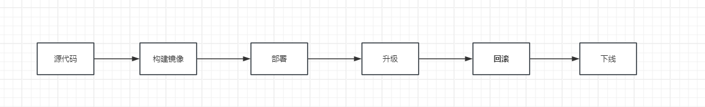

# 工作负载资源对象

    在k8s中，我们通常不会直接创建Pod,我们会使用工作负载资源（如Deployment,statefulSet）来创建和管理Pod。这种方式简化了Pod的管理，还提供了诸多如副本，滚动更新，回滚和自动扩展等高级功能，使得部署和管理应用程序变得更方便和高效。

常用的工作负载资源如下，根据应用程序的具体需求选择管理：

- Deployment(部署)

  管理无状态应用程序的部署，支持 Pod 多副本，滚动更新，副本数扩缩和回滚等功能

- StatefulSet（有状态集）

  管理有状态应用程序的部署，确保每个 Pod 都有唯一的标识符，稳定的网络标识和独立的存储，并且按照顺序创建，更新和删除 Pod,以满足有状态应用程序部署所需的环境

- DaemonSet（守护进程集）

  管理节点级别的守护进程，确保在集群中的每个节点上都运行一个 Pod 脚本

- Job 和 CronJob（任务和定时任务）

  管理一次性任务或定期执行的任务。

## 部署和交付

    部署和交付是软件生命周期中的重要环节，内容如下

- 源代码

  在完成应用代码的开发后，将代码提交到代码仓库进行管理

- 构架镜像

  使用容器化技术（如 Docker）将应用程序构建成镜像，该镜像包含应用程序及其以来环境

- 部署

  使用镜像将应用程序部署到 k8s 集群中，并对外提供服务

- 升级

  针对应用程序的更新迭代，如新增功能，修复 bug 等，需要重新构建镜像并将其更新到 k8s 集群中

- 回滚

  如果升级出现问题，则需要回滚到之前的可用版本

- 下线

  当一个应用程序不再需要提供服务时，需要将其从目标环境中下载

## Deployment(部署)

    Deployment是最常用的工作负载资源，具备以下几个功能

- 副本管理

  确保指定数量的 Pod 副本在集群中运行。如果 Pod 副本数小于期望值，会自动创建 Pod;反之则删除多余的 Pod

- 滚动更新

  采用滚动更新策略，逐步进行新旧版本 Pod 的替换，保障业务的连续性

- 版本回滚

  如果应用程序在升级后出现问题或者不符合预期，可以进行回滚操纵，以快速恢复到先前可用版本

  我们使用 Deployment 创建一个完整的部署交付部署流程，内容在 6.1 章
