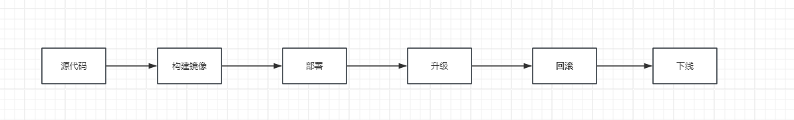

# 使用 Deployment 完成部署和交付

    部署和交付是软件生命周期中的重要环节，内容如下



## 1. 获取源代码

这里一份[博客 web 应用代码](https://gitee.com/zhenliangli/django-web-demo)，架构如下


下载代码到本地

```linux
    git clone  https://gitee.com/zhenliangli/django-web-demo
```

## 2. 构建镜像

在源代码根目录中，创建 Dockerfile 文件如下

```Dockerfile
    FROM python:3.9
    LABEL author="lizhenliang"
    COPY . /app
    RUN pip install Django -i https://mirrors.aliyun.com/pypi/simple
    WORKDIR /app
    EXPOSE 8080
    CMD python manage.py runserver 0.0.0.0:8080
```

根据 Dockerfile 构建 Docker 镜像

```linux
docker build -t django-blog:v1 .
```

查看构建后的镜像

```linux
docker images |grep django-blog
```

## 3. 推送到镜像仓库

目前构建的镜像是存储在本地的，而 k8s 集群是一个多节点环境，意味着 Pod 可以在任意一台节点上运行。因此，为了成功创建 Pod,必须确保该镜像在所有节点都是可访问的，这就需要我们将镜像推送到镜像仓库，而任意节点只要能保证可以访问镜像仓库就可以了。

仓库包含公共仓库和私有仓库（自建镜像仓库）。

- 公共仓库

  比如 [Docker hub](https://hub.docker.com),阿里云镜像仓库等

- 私有仓库

  在公司内部搭建的私有镜像仓库可以提供更高的灵活性，安全性和更快的传输速度。选择[Harbor 开源项目](https://goharbor.io)自建镜像仓库是一个不错的选择。

```linux
# 登录Docker hub

docker login

# 标记镜像tag为规范标签，替换仓库地址【conaco】为你的公共仓库名称用户或者私有仓库地址,否则无法推送到正确地址

docker tag django-blog:v1 conaco/django-blog:v1

# 推送

docker push conaco/django-blog:v1

# 尝试拉取镜像

docker pull conaco/django-blog:v1

```

## 4. 部署应用

```linux
# 创建blog命名空间

kubectl create namespace blog
```

创建 Deployment 和 Service 资源文件 django-blog.yaml 如下.

```yaml
apiVersion: apps/v1
kind: Deployment
metadata:
  name: django-blog
  namespace: blog
spec:
  replicas: 3
  selector:
    matchLabels:
      app: django
  template:
    metadata:
      labels:
        app: django
    spec:
      containers:
        - image: conaco/django-blog:v1
          name: web
          ports:
            - name: http
              containerPort: 8080
          resources:
            requests:
              memory: "128Mi"
              cpu: "250m"
            limits:
              memory: "512Mi"
              cpu: "500m"
          startupProbe:
            httpGet:
              path: /healthz
              port: 8080
            failureThreshold: 30
            periodSeconds: 10
          livenessProbe:
            httpGet:
              path: /healthz
              port: 8080
            initialDelaySeconds: 10
            periodSeconds: 10
          readinessProbe:
            httpGet:
              path: /healthz
              port: 8080
            initialDelaySeconds: 10
            periodSeconds: 10

---
apiVersion: v1
kind: Service
metadata:
  name: django-blog
  namespace: blog
spec:
  ports:
    - name: http
      port: 80
      protocol: TCP
      targetPort: 8080
  selector:
    app: django
  type: NodePort
```

```linux
# 创建资源

kubectl apply -f  django-blog.yaml

# 查看资源

kubectl get pods,deployment,service -n blog
```

资源如图所示


Deployment 管理 3 个 Pod,Service 通过 NodePort 类型对外提供服务，监听端口 31410,并将流量转发到 Pod 中的 8080 端口。三者之间关系如下


浏览器访问 http://<节点 IP>:31410 可以看到博客首页

## 5. 应用升级

当代码更新版本并且构建了新的版本镜像时，就需要更新部署中的应用镜像内容。

更新 k8s 部署中的镜像有两种方式

- 修改 yaml 资源文件,更新资源中的 image 字段为新的地址，然后使用更新资源命令,该命令会更新已部署的资源。

```linux
# kubectl apply -f  <资源文件>
kubectl apply -f  django-blog.yaml
```

- 直接更新资源镜像地址。

```linux
# kubectl set image <资源类型>/<资源名称>  <资源容器>=<镜像地址>
kubectl set image  deployment/django-blog web=conaco/django-blog:v1 -n blog

```

无论采用上述哪种方式更新，一旦执行成功，k8s 就会自动触发滚动更新，逐步替换旧版本中的 Pod。

以下命令可以实时监控滚动更新过程

```linux
# kubectl rollout status <资源类型>/<资源名称>
kubectl rollout status deployment/django-blog -n blog

```

```linux
#暂停滚动更新
# kubectl rollout pause <资源类型>/<资源名称>
kubectl rollout pause deployment/django-blog -n blog

#恢复暂停的滚动更新
# kubectl rollout resume <资源类型>/<资源名称>
kubectl rollout resume deployment/django-blog -n blog

#重启（重建）所有Pod的滚动更新
# kubectl rollout restart <资源类型>/<资源名称>
kubectl rollout restart deployment/django-blog -n blog
```

### 滚动更新策略

Deployment 更新策略的默认配置如下

```yaml
apiVersion: apps/v1
kind: Deployment
metadata:
  name: django-blog
  namespace: blog
spec:
  replicas: 3
  selector:
    matchLabels:
      app: django
  strategy:
    rollingUpdate:
      maxSure: 25%
      maxUnavailable: 25%
    type: RollingUpdate
```

- strategy.rollingUpdate.maxSure

  超过期望副本数 Pod 的最大数量，该值为一个整正数或者百分比。表示更新过程中启动的 Pod 总数量不能超过 （期望副本数 + strategy.rollingUpdate.maxSure）个。

- strategy.rollingUpdate.maxUnavailable

  不可用的 Pod 的最大数量，该值为一个整正数或者百分比。示更新过程中不可用的 Pod 总数量不能超过 （期望副本数 + strategy.rollingUpdate.maxSure）个。如果该值设置过大，可能导致 k8s 一次性停止过多的旧 Pod 并等待新的 Pod 启动从而导致服务短时间中断。

- strategy.type

  指定策略类型，默认值为“RollingUpdate（滚动更新）”。此外还支持“Recreate（重建）”，该策略下，Deployment 会先停止和删除旧的 Pod,然后创建新版本 Pod,这意味服务会短时间中断。

### 容器健康检查的重要性。

滚动更新过程中，如果新版本 Pod 由于某种原因无法启动，k8s 会终止更新过程，以防止进一步升级产生负面影响。

如果容器启动成功，但是服务无法正常启动，这时 k8s 无法判别服务正常，则被认为容器更新成功，继续下一步升级，从未导致服务无法访问。

配置就绪探针可以避免这种问题，配置就绪探针后，只有就绪探针成功，k8s 升级才会继续，这确保了只有新的 Pod 准备好接受流量后才会删除相应的旧版本 Pod,从为避免滚动更新中出现的异常服务中断。

## 6. 应用回滚

回滚本质是对旧版本的滚动更新。

```linux
# 查看历史版本
# kubectl rollout history <资源类型>/<资源名称>
kubectl rollout history deployment/django-blog -n blog

# 回滚到上一个版本
# kubectl rollout undo <资源类型>/<资源名称>
kubectl rollout undo deployment/django-blog -n blog

#暂停滚动更新
# kubectl rollout pause <资源类型>/<资源名称>
kubectl rollout pause deployment/django-blog -n blog

#恢复暂停的滚动更新
# kubectl rollout resume <资源类型>/<资源名称>
kubectl rollout resume deployment/django-blog -n blog

#重启（重建）所有Pod的滚动更新
# kubectl rollout restart <资源类型>/<资源名称>
kubectl rollout restart deployment/django-blog -n blog
```

## 7. 应用的扩容与缩容

当访问量激增，可以扩展 Pod 数量来提高并发能力。反之，可以删减 Pod 数量。

```linux
# kubectl scale deployment <资源名称> --replicas=<数量>
kubectl scale deployment django-blog --replicas=5 -n blog
```

## 8. 应用下线

删除相关资源

```linux
# 使用资源文件进行删除
kubectl delete -f <资源文件>
```

```linux
# 直接删除deployment相关资源对象
kubectl delete deployment/<资源名称>

# 直接删除Service相关资源对象
kubectl delete Service/<资源名称>
```

## 9. 灰度发布

灰度发布一种主流的发布方案，在灰度发布过程中，一小部分用户流量首先被转发到新版本进行测试和验证。新版本验证通过后，逐步增加流量比例将全部流量转到新版本中。

这种分阶段的升级方式相比滚动更新更加灵活，风险更小。适用于最小化风险的业务场景，而滚动更新更适用于快速升级的场景。

虽然 k8s 没有提供原生的灰度发布功能，但是我们可以通过配置简单实现。

1. 创建一个新的 Deployment,内容和旧版本 Deployment 相同，修改其中的名称和镜像资源版本。
2. 将新版本的 Pod 资源数量设置为 n,旧版本的资源数量相应缩减 n。这样一部份流量就由新版本占用。
3. 新版本验证通过后，将新版本 Pod 数量修改为全部数量，旧版本 Pod 数量缩减为 0。
