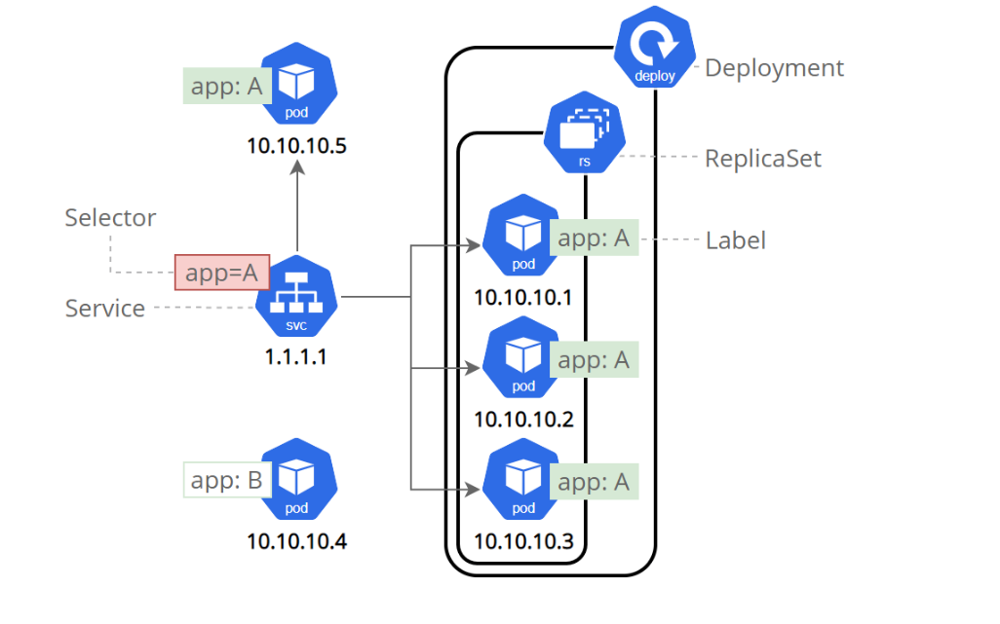

# Service

_传统虚拟机应用中，使用虚拟机 IP 地址访问应用程序，即使虚拟机重启或者应用重新部署，IP 也不会发生变化。但 Pod 的特点是“临时性”，可以随时启动，停止和删除，它的 IP 会随着重建而发生变化，因此无法通过虚拟机 IP 进行访问，为了解决这个问题，引入了 Service 概念。_

Service 是 Kubernetes 中的一种资源对象，用于定义一组 Pod 的网络访问规则，**它为 Pod 提供了一个稳定的统一访问入口,主要用于服务互相内部访问**，允许客户端始终使用同一个 IP 地址进行访问。其主要实现了以下两个功能：

- 负载均衡

  当多个 Pod 提供服务时，Service 通过负载均衡算法将请求分发到这些 Pod 上，从而实现应用程序的负载均衡。

- 服务发现

  Service 提供了一种服务发现机制，自动维护后端 Pod IP 的变化，从而保证客户端访问应用程序不受后端 Pod 变化的影响。



## 资源常用标签

```yaml
apiVersion: v1
kind: Service # 服务为Service
metadata:
  name: my-service # service名称
spec:
  ports: # 端口配置<object[]>
    - name: http # 端口名称
      port: 80 #  映射端口
      protocol: TCP #端口协议，支持 TCP,UDP,SCTP,默认TCP
      targetPort: 80 #目标端口，即容器中应用程序监听的端口
      #nodePort: 30001 # 仅当type: NodePort起效，为Sevice指定外部访问固定端口
    - name: https # 端口名称
      port: 443 #  映射端口
      protocol: TCP #端口协议，支持 TCP,UDP,SCTP,默认TCP
      targetPort: 443 #目标端口，即容器中应用程序监听的端口
  selector: # 标签选择器，定义该Servic应当转发流量到哪些Pod
    app: podMatchLabel # 为app=podMatchLabel的Pod启用该Service，
  type: NodePort #公开类型
```

### 常用命令

- 创建

  创建 Service 资源如下 service.yaml

```yaml
apiVersion: v1
kind: Service
metadata:
  name: my-service
spec:
  ports:
    - name: http
      port: 80
      protocol: TCP
      targetPort: 80
    - name: https
      port: 443
      protocol: TCP
      targetPort: 443
  selector:
    app: podMatchLabel
  type: NodePort
```

```linux
# 根据资源文件创建Serevice
kubectl apply -f  service.yaml
```

- 查看

```linux
# 查看所有service
kubectl get service

# 查看指定名称的Service
kubectl get service <serviceName>
```

结果如下：


- 查看结果其中各个字段含义如下

  - NAME

    名称

  - TYPE

    公开类型，默认类型为 ClusterIP

  - CLUSTER-IP

    集群 IP 地址，也称为虚拟 IP 地址，供集群其他节点在内部访问，其他 Service 下的 Pod 想要访问该 Service 下的 Pod,必须通过 CLUSTER-IP 访问。Cluster IP 无法被 ping，他没有一个“实体网络对象”来响应。

  - EXTERNAL-IP

    外部 IP 地址。当正确使用 LoadBalancer 或 ExternalName 类型时，才会显示外部 IP 地址，否则会显示“none”或者“pending”

  - PORT(S)

    公开端口和协议

  - AGE

    已创建时长（s）

综上所述

上图中 名称为 my-service 的 Service 分配的虚拟 IP 地址是“10.111.174.165”，http 监听的 TCP 端口是 80 和 443，Service 可以在集群中的任意 Pod 或节点上通过地址“10.111.174.165:80”访问这组 Pod.

分配的外部固定端口为 32169 和 32642,外部应用可以通过“服务器 IP:32169”问这组 Pod.

### Service 公开类型（spec.type）

定义了 Service 如何对外部网络公开，并支持四种公开类型

- ClusterIP

  默认类型，Service 会被分配一个虚拟 IP 地址。**集群中的应用程序**可以通过该 IP 地址访问 Service。

  适用于应用程序仅需要在集群内部访问的场景。

- NodePort

  在每个节点上开放一个固定端口，并将该端口映射到 Service 上。这允许**集群外部的用户**可以通过节点 IP 地址和固定端口访问 Service。

  固定端口的范围是 3000~32767

  适用于应用程序需要集群外部访问的场景。

- LoadBalancer

- ExternalName
