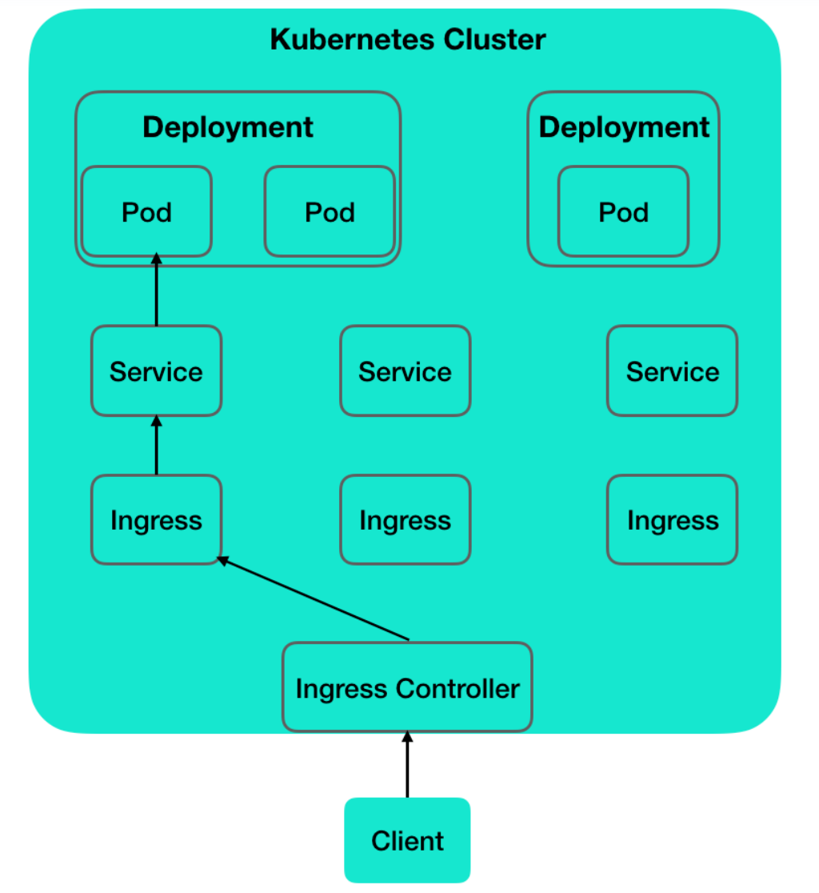
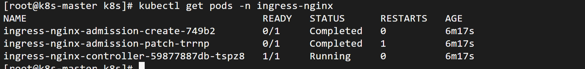
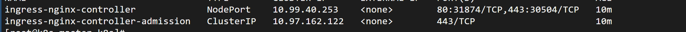
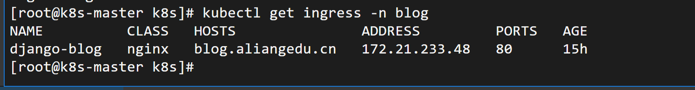

# Ingress 资源对象

_通过 Service **向外**暴露服务我们可以感觉到，Service 需要提供固定端口访问服务，如果服务过多，用户需要记住 IP 和端口访问很不方便，那如果提供一个类似 nginx 代理的功能，通过访问路径不同，转发网络到对应的 Service 则可以方便很多。但是在此之上，如果 Service 本身很多，那我们岂不是又要为每一个 Service 配置一个 nginx 代理，不过手动配置所有操作又过于麻烦，而 k8s 则为我们提供了一种内置资源的方案，即 Ingress。_

Ingress 是一个管理外部访问集群服务的规则集，从集群外部公开 HTTP 和 HTTPS 路由。为服务提供外部可访问的 URL，负载均衡流量，终止 SSL，提供基于名称的虚拟托管等。

Ingress 可以看作是对 Service 的反向代理。



## Ingress controller 部署

Ingress controller 是一个独立的组件，需要额外安装

```linux
# 安装官方维护的Ingress控制器

kubectl apply -f https://raw.githubusercontent.com/kubernetes/ingress-nginx/controller-v1.8.0/deploy/static/provider/baremetal/deploy.yaml

# 查看Ingress控制器 Pod对象确保正常启动

kubectl get pods -n ingress-nginx

```



_如果 ingress-nginx-controller 状态为 ContainerCreating，可能是镜像拉取问题，需要手动拉取镜像 docker pull k8s.gcr.io/ingress-nginx/controller:v1.0.0_

上图可以看到，Ingress controller 作为一个 Pod 存在，状态为 Running。

检查已创建的服务是否已连接到外部负载均衡器

```linux
get svc -n ingress-nginx
```



其中 31875 映射 80，说明<服务器 IP:31875>处理 HTTP 请求;30504 映射 443,，说明<服务器 IP:30504>处理 HTTPS 请求

## 对外公开 HTTP 服务

创建资源如下 ingress-blog.yaml，其中的 django-blog Service 为 6.1 章节创建的资源，**且确保 ingress 资源的命名空间和服务命名空间一致，ingress只能重定向到统一命名空间内的服务**:

```yaml
apiVersion: networking.k8s.io/v1
kind: Ingress
metadata:
  name: django-blog
  namespace: blog
spec:
  ingressClassName: nginx #控制器类名，表示使用哪个Ingress controller
  rules: #定义路由规则，可以包含一条或多条
    - host: blog.aliangedu.cn # 指定域名，未指定则通过http访问
      http:
        paths:
          - path: /
            pathType: Prefix
            backend: #定义转发目标配置
              service:
                name: django-blog # 指定后端的 Service 名称
                port:
                  number: 80 # 指定后端服务的端口
```

上述内容表示将访问地址 http://blog.aliangedu.cn 的请求转发到 Service(django-blog)关联的后端 Pod

```linux
# 创建 Ingress 资源，创建完成后，该资源会被Ingress controller自动转为对应的nginx配置

kubectl create -f ingress-blog.yaml

# 查看Ingress 对象

kubectl get ingress -n blog

```

结果如下:


输出结果中，各字段含义如下

- NAME

  名称

- CLASS

  Ingress 控制器的类名称

- HOST

  访问的域名

- ADDRESS

  访问的 IP 地址，即 Ingress 控制器 Pod 所在节点的 IP 地址

- PORTS

  访问的端口，即 Ingress 控制器监听的端口

- AGE

  已存活时间

```linux

# 模拟 HTTP 请求，通过指定主机头（Host）来访问指定域名，并将其发送到 Ingress controller 服务器地址，32251为Ingress controller的Pod对外暴露的端口

curl -H "Host: blog.aliangedu.cn" http://172.21.233.48:32715/
```

## 基于请求路径转发不同的服务

## Ingress 配置 HTTPS

## Ingress 自定义配置

## Ingress 灰度发布

```

```
