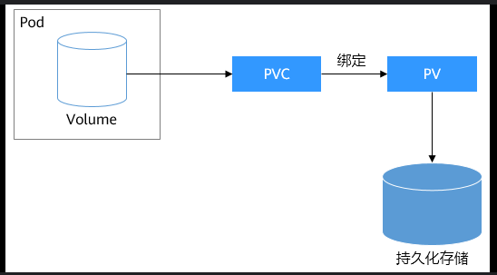
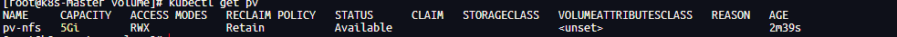
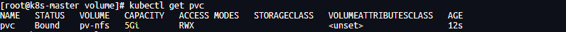

# 存储管理

k8s 提供卷和持久卷解决 Pod 中的数据持久化问题。

## 卷

卷是一种用于在 Pod 中存储和共享数据的抽象。它提供了一种将存储设备挂载到 Pod 中的机制。类型如下

- 临时存储（emptyDir）

  用于 Pod 容器之间数据共享。

  **生命周期与 Pod 一致，随着 Pod 的销毁而销毁**

  配置如下 emptydir.yaml:

  ```yaml
  apiVersion: v1
  kind: Pod
  metadata:
    name: pod-emptydir
  spec:
    containers:
      - name: app
        image: centos
        command:
          [
            "/bin/sh",
            "-c",
            "for i in {1..10000};do echo $i >> /opt/file.txt;sleep 1;done",
          ]
        volumeMounts:
          - name: data
            mountPath: /opt
      - name: sidecar
        image: centos
        command: ["/bin/sh", "-c", "tail -f /opt/file.txt"]
        volumeMounts:
          - name: data
            mountPath: /opt
    volumes:
      - name: data
        emptyDir: {}
  ```

  ```linux
  #创建卷
  kubectl create -f emptydir.yaml
  ```

  上述 pod 中创建了两个容器和一个卷。卷被挂载到两个容器各自的/opt 路径下，其中 app 容器每隔一秒不断写入数据，sidecar 容器读取数据并输出。由于这两哥容器的/opt 都是使用 emptyDir 共享的，所以可以从 sidecar 容器中读取到 app 容器写入的数据，执行下述操作验证

  ```linux
  # 可以看到数据在不断写入
   kubectl logs pod-emptydir -c sidecar -f
  ```

  为了防止数据无限增长，可以配置如下内容限制

  ```yaml
  volumes:
    - name: data
      emptyDir:
        sizeLimit: 1Gi
  ```

  设置卷的最大值为 1Gi,一旦超过，k8s 将会删除空目录并重启 Pod

- 本地存储（hostPath）

  用于将主机上的任意目录或文件挂载到 Pod 上，可以使容器访问主机数据。

  **Pod 删除不会影响卷数据**

  volumes 配置如下:

  ```yaml
  volumes:
    - hostPath:
        path: /path1
        type: DirectoryOrCreate
        name: data1
    - hostPath:
        path: /path2
        type: DirectoryOrCreate
        name: data2
  ```

  **需要注意**

  1. hostPath 卷是存储在主机上的，Pod 重建后，如果调度在不同的主机，是无法访问之前的数据的。另外，如果一个主机上多个 Pod 使用相同的主机路径，可能会造成数据混乱。
  2. hostPath 不支持存储容量限制。
  3. 创建 Pod 时，如果卷的创建条件不满足 Type 设置期望，会引发检查类型失败异常，Pod 状态将会变为“ContainerCreating”

  type 是个枚举值，值为下列内容：

  - ""

    该字段未指定或者为空时，默认是 DirectoryOrCreate

  - DirectoryOrCreate

    如果指定目录不存在，则自动创建并将权限设置为 0755

  - Directory

    指定目录必须存在

  - FileOrCreate

    如果指定目录不存在，则自动创建并将权限设置为 0644

  - File

    指定文件必须存在

  - Socket

    指定 Socker 文件必须存在

  - CharDevice

    指定字符设备必须存在

  - BlockDevice

    指定块设备必须存在

- 存储对象(ConfigMap,Secret)
- 自建存储系统(NFS,Ceph,ISCSI)

  用于将服务器上的共享目录挂载到 Pod 中，实现 Pod 之间的数据共享和数据持久化存储，服务器安装好对应的远端存储服务后，进行如下配置

  volumes 配置如下:

  ```yaml
  volumes:
    - name: data
      nfs:
        server: 192.168.1.74 #指定NFS服务器地址
        path: /path # 指定NFS共享路径
  ```

- 存储对象(persistentVolumnClaim)

## 持久卷

部署应用程序时，通常定义资源文件来描述应用程序的各种配置和参数。对于一些外部存储系统的使用，配置卷就会变得相对复杂，可能需要指定很多额外的参数，比如 IP 地址，认证凭证等，这会增加开发工程师使用存储的难度。不同的岗位涉及不同的专业知识，具体的外部存储应当由存储工程师或者运维工程师来完成。

为了分离上述的职责，k8s 提供了以下两种资源

- PersistentVolume（持久卷 PV）
  用于声明访问存储系统的细节，主要包括外部存储系统的 IP 地址，认证凭证等，不关心集群内部的存储细节。

- PersistentVolumeClaim（持久卷申请 PVC）
  用于管理集群持久存储，主要设置存储容量和访问模式，不关心访问何种存储系统。

开发工程师创建 PV，运维工程师创建 PVC，PV 与 PVC 绑定关联，职责分开管理



### PV

创建资源 pv-nfs.yaml

```yaml
apiVersion: v1
kind: PersistentVolume
metadata:
  name: pv-nfs
spec:
  capacity:
    storage: 5Gi # 存储容量
  accessModes:
    - ReadWriteMany #访问模式，ReadWriteMany表示多个节点可以同时读写
  # persistentVolumeReclaimPolicy: Retain  # 回收策略
  # storageClassName: manual #存储类
  nfs: #使用nfs作为存储系统(这里默认学习者已经安装好了该服务)
    server: 192.168.1.74
    path: /data/k8s-pv
```

```linux
kubectl create -f pv-nfs.yaml
```

查看资源

```linux
kubectl get pv
```



- NAME

  名称

- CAPACITY

  存储容量

- ACCESS MODES

  访问模式

  - ReadWriteOnce: 表示多个节点可以同时读写

  - ReadWriteMany: 表示只能被单个节点读写。

- RECLAIM POLICY

  回收策略，当 PVC 与 PV 解绑后，根据该规则，决定 PV 后续操作,静态供给默认为 Retain，动态攻击默认为 Delete。

  - Retain：PV 不会被自动删除，数据仍然存在，但需要手动清理和重新声明。
  - Recycle：PV 会被清理，旧数据会被删除，PV 可以重新使用。
  - Delete：PVC 删除后，PV 以及其对应的后端存储会被一并删除。

- STATUS

  状态，“Available”表示 PV 可用，即未绑定 PVC

- CLAIM

  绑定 PVC 名称

- STORAGECLASS

  存储类

- REASON

  原因

### PVC

创建资源 pvc-app.yaml

```yaml
apiVersion: v1
kind: PersistentVolumeClaim
metadata:
  name: pvc
spec:
  accessModes:
    - ReadWriteMany #访问模式，ReadWriteMany表示多个节点可以同时读写
  resources: #使用nfs作为存储系统
    requests:
      storage: 5Gi #存储容量
```

```linux
kubectl create -f pvc-app.yaml
```

查看资源

```linux
kubectl get pvc
```



- NAME

  名称

- STATUS

  状态，“Bound”表示该 PVC 已经申领一个 PV

- VOLUME

  申领的 PV 名称

- CAPACITY

  存储容量

- ACCESS MODES

  访问模式

  - ReadWriteOnce: 表示多个节点可以同时读写

  - ReadWriteMany: 表示只能被单个节点读写。

- STORAGECLASS

  存储类

### 关联 PVC 和 PV

你可能会发现 PVC 自动申领了 PV，这是由持久卷控制器（VolumeController）实现的，它负责监视集群中的 PVC 对象，并自动按照一定的规则分配尚未申领 PV 的 PVC。**PV 和 PVC 一对一绑定，一旦绑定，则不能为其他 PVC 服务**。

匹配规则通常包括

- 存储大小: PV 存储容量必须大于或等于 PVC
- 访问模式：PV 访问模式必须满足 PVC 的需求
- StorageClass: 如果 PVC 指定了 StorageClass，PV 必须与之相同
- 如果多个 PVC 符合同一个 PV 的条件，则按照先来先服务的原则绑定

### Pod 使用 PVC

```yaml
apiVersion: apps/v1
kind: Deployment
metadata:
  name: web
spec:
  replicas: 3
  selector:
    matchLabels:
      app: nginx
  template:
    metadata:
      labels:
        app: nginx
    spec:
      containers:
        - name: web
          image: nginx:1.23
          volumeMounts:
            - name: data
              mountPath: /data
      volumes:
        - name: data
          persistentVolumeClaim:
            claimName: pvc
```

## [PV 动态供给](https://kubernetes.io/zh-cn/docs/concepts/storage/dynamic-provisioning/)

_该内容跳过（自行学习）_

一个 PV 只能和一个 PVC 绑定，如果 PVC 未找到匹配的 PV，则 PVC 将处于“Pending”状态，为了避免这种这种情况，通常会预先创建多个 PV，等待后续 PVC 自动申领，这称为静态供给。

但是如果 PVC 的数量到达成百上千，这种方式就会显得不够灵活并且难以管理。为了解决这个问题，k8s 引入了动态供给机制，在需要时自动创建 PV。

## 内置存储对象

本质功能和卷一样，但是属于集群功能，修改的数据不再限制于本机，而是会同步到集群内所有 Pod 当中，使得不需要重新构建镜像和更新 Pod 的情况下，修改程序配置。

- ConfigMap

  一种用于存储配置信息的资源对象，它以键值对的形式保存数据

- Secret

  一种用于存储敏感信息的资源对象。

### ConfigMap

创建资源 configmap.yaml

```yaml
apiVersion: v1
kind: ConfigMap
metadata:
  name: nginx-config
data:
  a.conf: | # | 表示多行字符串
    server {
      listen 80;
      server_name a.example.com;
      location / {
        proxy_pass http://192.168.1.71:8080;
      }
    }
```

```linux
kubectl create -f configmap.yaml
```

查看资源

```linux
kubectl get cm
```

将 CongfigMap 挂载到 Pod 上

创建资源 configmap-pod.yaml

```yaml
apiVersion: v1
kind: Pod
metadata:
  name: nginx-proxy
spec:
  containers:
    - name: web
      image: nginx:1.23
      volumeMounts:
        - name: config
          mountPath:
            /etc/nginx/conf.d
            # 注意该挂载操作会覆盖文件夹下所有内容，如果不想覆盖，需要指定subPath
  volumes:
    - name: config
      configMap:
        name: nginx-config
```

```linux
kubectl create -f configmap-pod.yaml

# 查看是否挂在成功
kubectl exec nginx-proxy -- ls /etc/nginx/conf.d
```

修改并更新 Configmap，直接修改 configmap.yaml

```yaml
apiVersion: v1
kind: ConfigMap
metadata:
  name: nginx-config
data:
  a.conf: |
    server {
      listen 80;
      server_name a.example.com;
      location / {
        proxy_pass http://192.168.1.71:8080;
      }
    }
  b.conf: |
    server {
      listen 80;
      server_name b.example.com;
      location / {
        proxy_pass http://192.168.1.71:8080;
      }
    }
```

```linux
更新资源配置
kubectl apply -f configmap.yaml

# 查看是否挂在成功(需要稍等片刻，更新定期执行)
kubectl exec nginx-proxy -- ls /etc/nginx/conf.d
```

### [Secret](https://kubernetes.io/zh-cn/docs/concepts/configuration/secret/)

支持以下类型

- docker-registry

  存储访问镜像仓库的认证凭证

- generic

  用于存储任意格式的数据，比如密码，密钥

- tls

  用于存储 TLS 证书，如 HTTPS 证书
