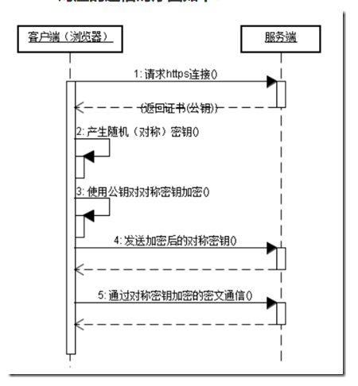

# HTTPS

## [HTTPS 简介](https://www.runoob.com/w3cnote/https-ssl-intro.html)

超文本传输安全协议（英语：Hypertext Transfer Protocol Secure，缩写：HTTPS，常称为 HTTP over TLS，HTTP over SSL 或 HTTP Secure）是一种网络安全传输协议。具体介绍以前先来介绍一下以前常见的 HTTP，HTTP 就是我们平时浏览网页时候使用的一种协议。HTTP 协议传输的数据都是未加密的，也就是明文，因此使用 HTTP 协议传输隐私信息非常不安全。HTTP 使用 80 端口通讯，而 HTTPS 占用 443 端口通讯。在计算机网络上，HTTPS 经由超文本传输协议（HTTP）进行通信，但利用 SSL/TLS 来加密数据包。HTTPS 开发的主要目的，是提供对网络服务器的身份认证，保护交换数据的隐私与完整性。这个协议由网景公司（Netscape）在 1994 年首次提出，随后扩展到互联网上。

### HTTPS 工作原理

HTTPS 在传输数据之前需要客户端（浏览器）与服务端（网站）之间进行一次握手，在握手过程中将确立双方加密传输数据的密码信息。TLS/SSL 协议不仅仅是一套加密传输的协议，更是一件经过艺术家精心设计的艺术品，TLS/SSL 中使用了非对称加密，对称加密以及 HASH 算法。握手过程的具体描述如下：

1. 浏览器将自己支持的一套加密规则发送给网站。
2. 网站从中选出一组加密算法与 HASH 算法，并将自己的身份信息以证书的形式发回给浏览器。证书里面包含了网站地址，加密公钥，以及证书的颁发机构等信息。
3. 浏览器获得网站证书之后浏览器要做以下工作：
   1. 验证证书的合法性（颁发证书的机构是否合法，证书中包含的网站地址是否与正在访问的地址一致等），如果证书受信任，则浏览器栏里面会显示一个小锁头，否则会给出证书不受信的提示。
   2. 如果证书受信任，或者是用户接受了不受信的证书，浏览器会生成一串随机数的密码，并用证书中提供的公钥加密。
   3. 使用约定好的 HASH 算法计算握手消息，并使用生成的随机数对消息进行加密，最后将之前生成的所有信息发送给网站。
   4. 网站接收浏览器发来的数据之后要做以下的操作：
      1. 使用自己的私钥将信息解密取出密码，使用密码解密浏览器发来的握手消息，并验证 HASH 是否与浏览器发来的一致。
      2. 使用密码加密一段握手消息，发送给浏览器。
   5. 浏览器解密并计算握手消息的 HASH，如果与服务端发来的 HASH 一致，此时握手过程结束，之后所有的通信数据将由之前浏览器生成的随机密码并利用对称加密算法进行加密。

这里浏览器与网站互相发送加密的握手消息并验证，目的是为了保证双方都获得了一致的密码，并且可以正常的加密解密数据，为后续真正数据的传输做一次测试。另外，HTTPS 一般使用的加密与 HASH 算法如下：

- 非对称加密算法：RSA，DSA/DSS
- 对称加密算法：AES，RC4，3DES
- HASH 算法：MD5，SHA1，SHA256

HTTPS 对应的通信时序图如下：

### HTTPS 协议和 HTTP 协议的区别：

- https 协议需要到 ca 申请证书，一般免费证书很少，需要交费。
- http 是超文本传输协议，信息是明文传输，https 则是具有安全性的 ssl 加密传输协议。
- http 和 https 使用的是完全不同的连接方式用的端口也不一样,前者是 80,后者是 443。
- http 的连接很简单,是无状态的。HTTPS 协议本身是无状态的，然而，HTTPS 使用了 TLS/SSL 协议进行加密，而 TLS 是一种有状态的协议，因此 HTTPS 在加密层面上是有状态的
- HTTPS 协议是由 SSL+HTTP 协议构建的可进行加密传输、身份认证的网络协议， 要比 http 协议安全。
