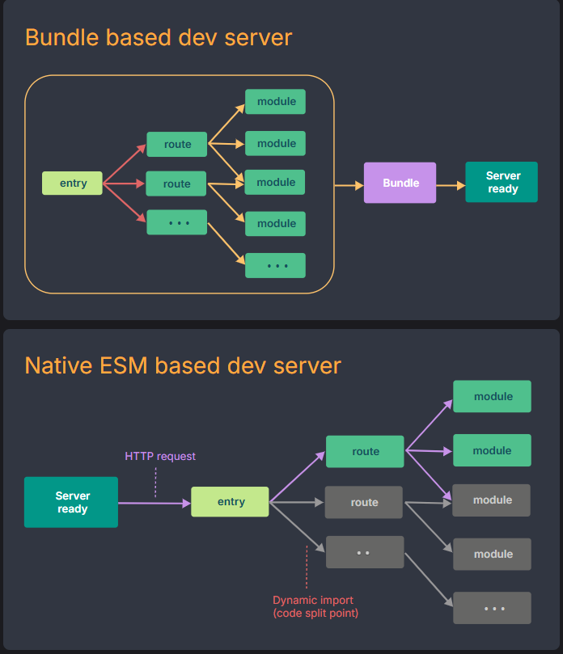

# vite 简介

vite的目标为现代浏览器，如果要兼容旧版浏览器，请慎重考虑。

一种新型前端构建工具，能够显著提升前端开发体验。Vite 的目标不在于满足所有用户的每一个使用场景。Vite 旨在开箱即用地支持构建 Web 应用的最常见的模式，

## 遵循开发规范

1. 源代码必须采用 ESM 形式编写；对于非 ESM 的依赖项，为了使其正常工作，需要 预先将其打包为 ESM。


## 特性

1. 一套开发服务器，基于 原生 ES 模块 提供了 丰富的内建功能，如速度快到惊人的 模块热替换（HMR）。
2. 一套生产构建指令，它使用 Rollup 打包你的代码，并且它是预配置的，可输出用于生产环境的高度优化过的静态资源。
3. 支持插件和JS API扩展
4. Vite 通过在一开始将应用中的模块区分为 依赖 和 源码 两类，改进了开发服务器启动时间。Vite 将会使用 esbuild 预构建依赖。Vite 只需要在浏览器请求源码时进行源码转换并按需提供。根据情景动态导入代码，即只在当前屏幕上实际使用时才会被处理。

    

5. 为什么vite热更新效率高于webpack？
   webpack等基于打包启动的构建工具，在启动时，会先构建所有的文件为chunk,当源文件发生变化，通常需要整个重新构建并重载页面。如果支持了热更新（HMR）则不需要整个重新构建，但是需要定位发生变化的文件所在chunk（这个chunk中可能不单单包含改动文件，还包含一些其他不需要重新编译的文件文件），然后重新构建chunk包含的所有模块为新chunk并替换失效chunk从而避免了整体构建。但随着包体积增大，热更新的速度也会变慢。

   Vite冷启动并不会构建所有文件为chunk，而只会预构建第三方依赖，将其变为浏览器原生可用的ESM格式。Vite的热更新定位比webpack要精确的多，因为开发环境网页请求资源使用了浏览器的原生的ES模块，而并非chunk,所以当浏览器发起一个资源请求时，通常是针对一个源码文件的资源请求（其内部的依赖会被作为额外的请求再次请求网络访问，如果未发生改变，则会通过浏览器缓存机制返回）。如果该资源文件更新，那么只需要对这个文件重新编译即可，这就是为什么vite开发环境热更新速度远比webpack大的原因，即使后期随着包体积增大，也不会影响vite的热更新速度

6. vite冷启动会执行如下步骤

    - 插件系统初始化
    - 预构建依赖，对第三方依赖做预构建依赖，转换为浏览器能原生访问的ESM模块，这些依赖请求是被设置为强缓存的
    - 模块图初始化，当浏览器访问资源时，会更新该模块图。

7. 为什么vite生产环境依旧需要打包，而不采用原生ESM模块？

   vite在生产环境还是会进行chunk分割打包，而不是使用原生的ESM模块。这是因为直接使用未打包的ESM模块会导致额外的网络返回。

    1. 嵌套导入太多，每个导入都会当作一次单独的http请求，这会造成雪崩式的网络请求。并且这些请求必须穿行发生，进一步加剧了问题。
    2. 网络请求太碎片化
    3. 即便 HTTP/2 多路复用，也救不了太多碎请求的开销

   为什么开发环境可以容忍这些问题？

   因为这时不同环境的需求不同，开发环境追求快速启动，快速更新，模块图精确，即使网络请求很多，但是网络延迟基本为0，宽带基本无消耗，直接硬盘读取模块，速度是非常快的。而生产环境则追求网络请求最小化，JS文件体积小，在网络请求很多的情况下，严重影响体验。所以生产环境必须打包。

8. 为什么vite没有在生产环境使用esbuild作为打包工具?
   
   即使vite在开发环境使用esbuild对第三方依赖进行了预构建，但是vite并没有在生产环境中使用esbuild作为打包工具，而是使用了rollup。这是因为Vite 目前的插件 API 与并不能被esbuld作为打包工具支持，这由esbuild决定。

## 快速创建项目

```
 npm create vite@latest
```

## 问题

1. 什么是热更新
2. 
   热更新（Hot Module Replacement，简称 HMR）是前端开发中的一种技术，它允许你在 不刷新页面的情况下，将更改的模块 “热替换” 到正在运行的应用中，从而保留页面状态，提高开发效率。
3. 