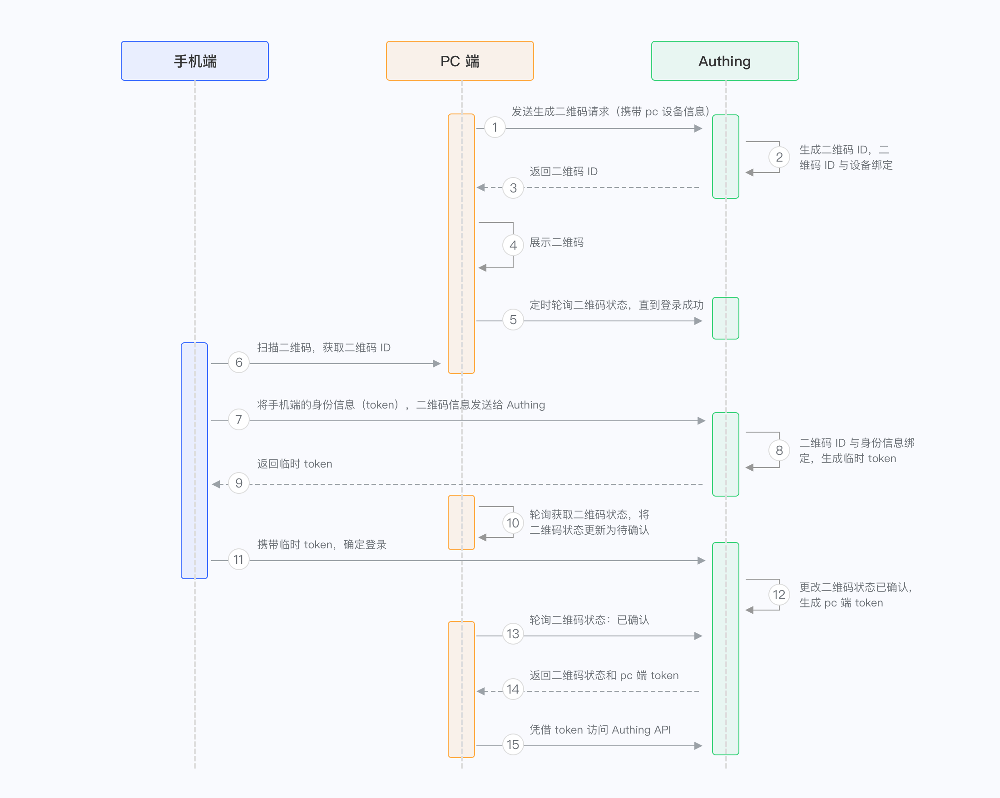

# 二维码

创建二维码可以通过多种方法实现，最常见的方式是使用 JavaScript 库或在线工具生成。

这里使用[qrcode.js](https://www.npmjs.com/package/qrcode) 库生成二维码

```js
 // 扫码后，会自动访问 https://www.npmjs.com/package/qrcode地址
  var segs = 'https://www.npmjs.com/package/qrcode'
  QRCode.toCanvas(segs, function (err, canvas) {
    if (err) throw err
    var container = document.getElementById('canvas')
    container.appendChild(canvas)
  })
```

## 如何实现扫码登陆流程

1. PC端携带PC设备信息访问后端地址获取二维码唯一ID，ID与设备绑定（获取二维码ID接口）
2. PC根据二维码ID和相关接口创建并展示二维码，同时轮询检查二维码状态。（轮询二维码状态接口）
3. 用户扫描二维码将会带着凭证信息和二维码Id访问相关接口，后端根据二维码ID判断本次二维码能否用于登录，更改登陆状态(修改二维码状态接口)
4. PC前端轮询检查二维码状态，状态已登录则获取登录信息并成功登录。

