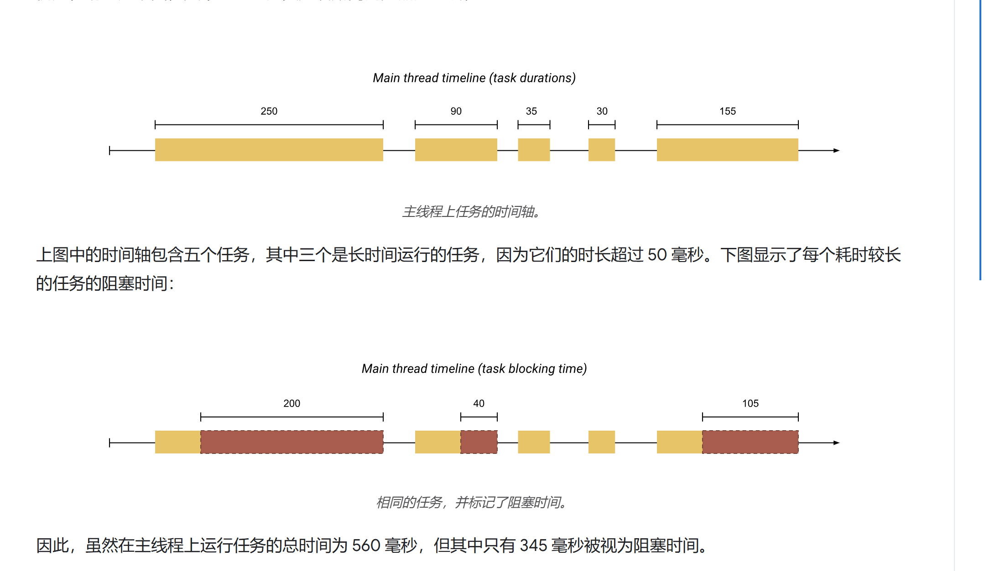
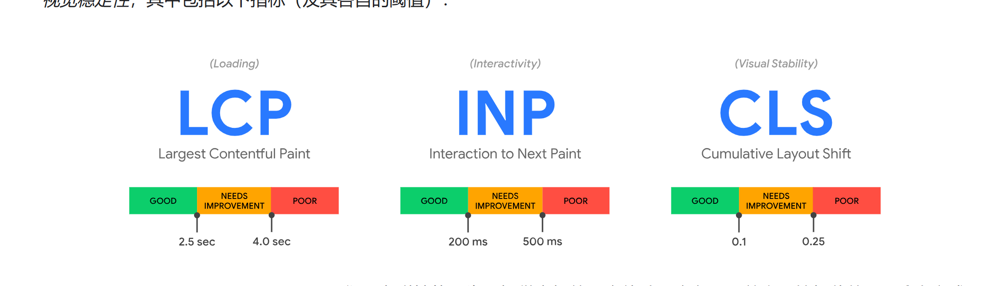
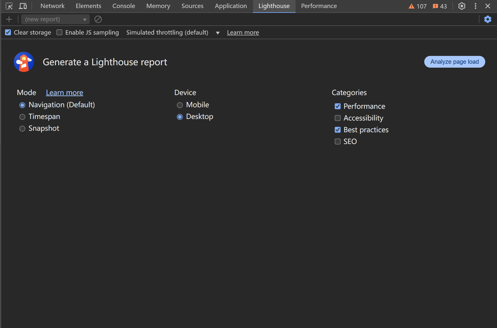
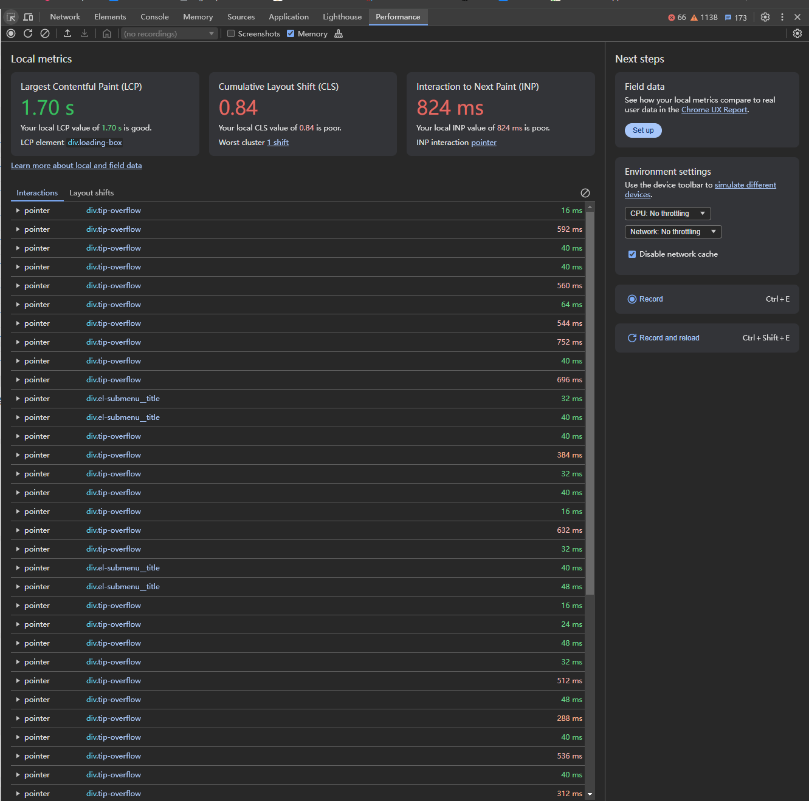
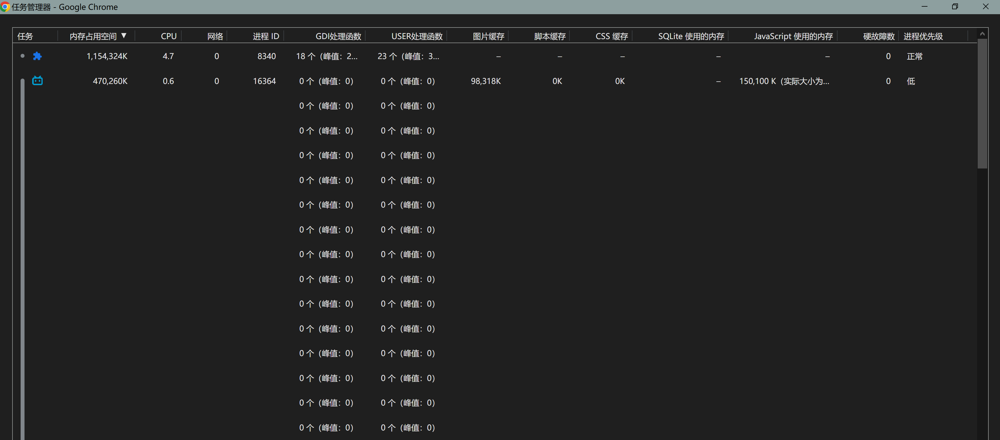
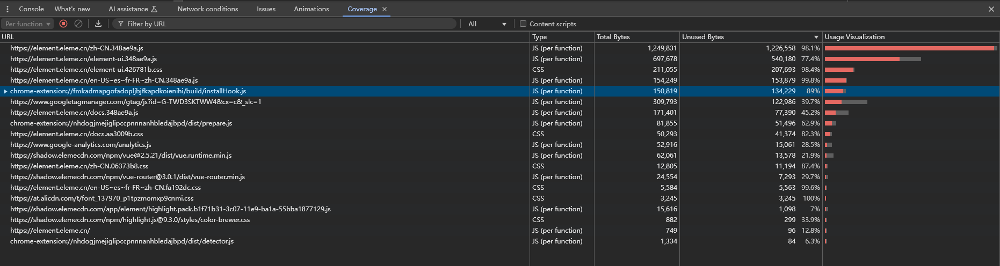

# 网站性能优化

_每当存在长任务（即在主线程上运行超过 50 毫秒的任务）时，主线程都会被视为“阻塞”。我们之所以说主线程处于“阻塞”状态，是因为浏览器无法中断正在执行的任务。_

## 性能指标

存在以下三种指标可供使用

1. [RAIL性能模型](https://web.dev/articles/rail?hl=zh-cn)

    RAIL 模型将用户体验分解为四个关键目标，并为开发者提供了具体的优化指导，帮助在页面加载和交互过程中实现更流畅的体验。
    - response: 对用户发起的事件应当在0-100ms内做出响应回馈，超过1000ms，用户可能就会失去专注力
    - animation: 目标上希望在10ms或更短的时间内生成一帧。技术上来说每一帧的最大预算是16ms，但是浏览器大约6ms才能渲染一帧，因此准则为10ms.
    - idle：最大限度的利用空闲时间。比如使用懒加载，利用空闲时间执行用户感知不到的非关键操作。尽量将任务切分为多个短任务，避免阻塞用户正在响应的任务。
    - load: 根据用户的设备和网络功能进行优化，以实现快速加载性能。初次加载在5s内或更短时间完成是一个不错的目标，后续加载最好在2s内完成。
  
2. [基于用户体验的核心指标](https://web.dev/explore/metrics?hl=zh-cn)

    用于衡量和优化用户与网站、应用或系统交互时的体验质量。用户体验的核心指标不仅仅关注系统本身的性能，还包括用户的情感反应、使用效率和满意度
    - LCP: 显示最大内容元素所需要的时间
    - CLS: 累积布局配置偏移
    - INP: 通过观察用户访问网页期间发生的所有点击、点按和键盘互动的延迟时间，评估网页对用户互动的总体响应情况
    - FCP: 用于衡量从用户首次导航到网页到网页任何一部分内容呈现在屏幕上的时间。
    - TBT: 总阻塞时间，衡量FCP之后由于主线程被阻塞从而导致输入响应被阻塞的总时间
        

3. [新一代的性能指标：Web Vitals](https://web.dev/articles/vitals?hl=zh-cn)

    Web Vitals 标准重点关注用户的核心体验，旨在提高网页的加载速度、响应性和稳定性，从而提升用户满意度。
    !
    - Largest Contentful Paint（LCP）: 显示最大内容元素所需要的时间
    - First Input Delay（FID）: 首次输入延迟时间
    - Cumulative Layout Shift（CLS）: 累积布局偏移

## 性能排查方案(网站性能监控)

1. 专业性能测试工具，比如[Lighthouse](https://developer.chrome.com/docs/lighthouse/overview?hl=zh-cn)，[WebPageTest](https://www.webpagetest.org/)
2. 第三方库，比如web-vitals.
3. 浏览器自带工具DevTools

    - **Lighthouse**面板
        根据项目场景综合分析当前页面并做出评分，提出一些优化意见。特别是在Web Vitals 指标方面。
        
    - **Performance**面板。
        用于实时监控和分析网页的运行时性能,查看浏览器的活动并捕捉页面加载过程中的事件，帮助开发者发现性能瓶颈和优化点。
        
    - **浏览器任务管理器**（shift+esc）
        
    - **coverage**面板
        查看已加载的js文件其中的代码实际使用率
        
    - **memory**面板
        查看当前浏览器的内存使用状况，可以分析内存泄漏等问题
        
    - **netWork**
        展示页面的资源网络加载情况
    - google chorme常用快捷键

        - 帧率监控： shift+ctrl+p 搜索fps

## 性能优化方案

了解网站响应的生命周期，从浏览器输入地址到页面被渲染显示都经历了什么，其中的每个步骤都会影响页面的加载效率。
可以从下列方面入手寻找解决方案

1. 从发出请求到收到响 应的优化，比如DNS查询、HTTP长连接、HTTP2、HTTP压缩，HTTP缓存等。
2. 关键渲染路径优化，比如是否存在不必要的重绘和回流。
3. 加载过程的优化，比如延迟加载，是否有不需要在首屏展示的非关键信息，占用了页面加载的时间
4. 资源优化，比如图片、视频等不同的格式类型会有不同的使用场景、在使用的过程中是否恰当。
5. 依赖预构建，启动时对第三方依赖进行预构建，这样当源文件发生改动时，热更新会跳过对这部分代码的重新编译过程。
6. 模块独立，异步加载，将改动频率小，逻辑复杂的组件或者模块单独拆分成chunk，使用异步加载。避免引入该模块的文件发生改动时，重复编译该组件。