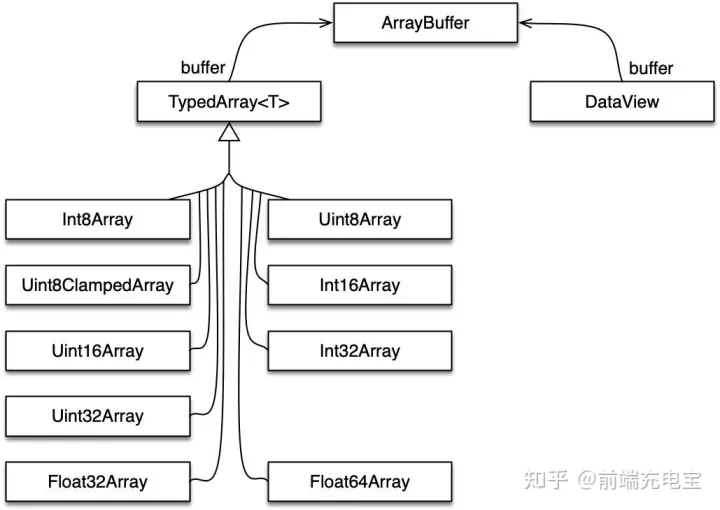
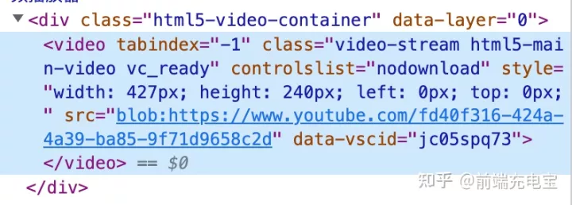

# Welcome

[谈谈JS二进制：File、Blob、FileReader、ArrayBuffer、Base64](https://zhuanlan.zhihu.com/p/568915443)

<!--
拥有
-->

---


---

Blob(binary large object)

  >Blob 对象表示一个**不可变、原始数据**的类文件对象。它的数据可以按文本或二进制的格式进行读取，也可以转换成 [ReadableStream](https://developer.mozilla.org/zh-CN/docs/Web/API/ReadableStream) 来用于数据操作。
  >
  >                                                                                                           ---MDN
 我们在node中尝试一下

```js
new Blob(array, options);
```

1. array：由 ArrayBuffer、ArrayBufferView、Blob、DOMString 等对象构成的，将会被放进 Blob；
2. options：可选的 BlobPropertyBag 字典，它可能会指定如下两个属性
     - type：默认值为 ""，表示将会被放入到 blob 中的数组内容的 [MIME](https://developer.mozilla.org/zh-CN/docs/Web/HTTP/Basics_of_HTTP/MIME_types) 类型。
     - endings：默认值为"transparent"，用于指定包含行结束符\n的字符串如何被写入，不常用。

```js
const blob = new Blob(["Hello World"], {type: "text/plain"});
console.log(blob.size); // 11
console.log(blob.type); // "text/plain"
```

---

> ReferenceError: Blob is not defined

失败了，node中不存在blob对象.<br>
[Node.js不存在有Blob类型,这仅仅是为浏览器提供的数据类型](https://www.coder.work/article/1394388)。<br>
>思考？

数据库存在Blob类型并且node是可以作为后端程序语言开发,那么它是如何接受数据库Blob对象的。<br>

[19.7.0版本后，node引入Blob。](https://nodejs.org/api/all.html#buffer_class-blob)

>思考？

我们平常在vue中为什么可以直接使用Blob，类似require等node专属的API为什么可以直接在vue中使用？vue运行属于什么环境

---

js是一种解释型语言，不能直接运行，需要运行环境。<br>

常见的运行环境有，web浏览器，后端服务器(nodejs环境)等。<br>

webpack中开发调试的书写环境并不是在浏览器中运行的，而是在node环境中运行的，它会在运行期间对代码进行一次编译，在内存中保存编译后的代码。
打开浏览器时，使用内存中保存的的编译内容，此时在浏览器环境中执行。<br>

构建后，运行在浏览器，

>思考 这并没有解决require是node专属的api问题？

这就是webpack等构建工具的作用了，他们会将require等引入方式打包成多种平台可以识别的方式。在浏览器运行项目时，会根据判断条件选择适合的引入方式。

>思考 构建文件中umd.js，.mjs的区别

answer [模块化历史，构建多种文件之间的的区别(.mjs, .umd...)）](https://jokerliang.com/difference-in-modularization-of-javascript.html)
---

```html

<iframe></iframe>

<script>

const iframe = document.getElementsByTagName("iframe")[0];
const blob = new Blob(["Hello World"], {type: "text/plain"});
iframe.src = URL.createObjectURL(blob);

</script>
```

---

## File

**File 对象是Blob的子集，且可以用在任意的 Blob 类型的 context 中。Blob 的属性和方法都可以用于 File 对象**
>注意：File 对象中只存在于浏览器环境中，在 Node.js 环境中不存在。

在 JavaScript 中，主要有两种方法来获取 File 对象：

- \<input> 元素上选择文件后返回的 FileList 对象；
- 文件拖放操作生成的 [DataTransfer](https://developer.mozilla.org/zh-CN/docs/Web/API/DataTransfer) 对象；

---

```html

<iframe></iframe>
<input id='file' type="file"></input>
<button onclick="getFile()">开始</button>
<script>
const iframe = document.getElementsByTagName("iframe")[0];
const blob = new Blob(["Hello World"], {type: "text/plain"});
iframe.src = URL.createObjectURL(blob);
function getFile(){
    const file = document.getElementById("file");
    const data = file.files[0]
    console.log(data)
    let dataUrl =  URL.createObjectURL(data);
    iframe.src =dataUrl
    URL.revokeObjectURL(dataUrl);
}
</script>

```

---

## FileReader

**FileReader 是一个异步 API，用于读取文件并提取其内容以供进一步使用。FileReader 可以将 Blob 读取为不同的格式。**
>注意：FileReader 仅用于以安全的方式从用户（远程）系统读取文件内容，不能用于从文件系统中按路径名简单地读取文件。

加载文件的API

- readAsArrayBuffer()：读取指定 Blob 中的内容，完成之后，result 属性中保存的将是被读取文件的 ArrayBuffer 数据对象；
- FileReader.readAsBinaryString()：读取指定 Blob 中的内容，完成之后，result 属性中将包含所读取文件的原始二进制数据；
- FileReader.readAsDataURL()：读取指定 Blob 中的内容，完成之后，result 属性中将包含一个data: URL 格式的 Base64 字符串以表示所读取文件的内容。
- FileReader.readAsText()：读取指定 Blob 中的内容，完成之后，result 属性中将包含一个字符串以表示所读取的文件内容。

---

```html
<input id='file' type="file"></input>

<script>
const fileInput = document.getElementById("file");
const reader = new FileReader();
//abort：该事件在读取操作被中断时触发；
//error：该事件在读取操作发生错误时触发；
//load：该事件在读取操作完成时触发；
//progress：该事件在读取 Blob 时触发，可用于处理上传进度事件
// 由于FileReader对象继承自EventTarget，因此还可以使用 addEventListener() 函数可使用的事件。
fileInput.onchange = (e) => {

   // file本身是一种特殊的Blob
   console.log(e.target.files[0].type);
    if(e.target.files[0].type==='image/jpeg'||e.target.files[0].type==='image/png'){
        reader.readAsDataURL(e.target.files[0]);
    }else{
        reader.readAsText(e.target.files[0]);
    }
}
reader.onload = (e) => {
    console.log(e.target.result);
}
</script>
```

---

## ArrayBuffer

ArrayBuffer 对象用来表示通用的、固定长度的原始二进制数据缓冲区。ArrayBuffer 的内容不能直接操作，只能通过 DataView 对象或 TypedArrray 对象来访问。这些对象用于读取和写入缓冲区内容。
ArrayBuffer 本身就是一个黑盒，不能直接读写所存储的数据，需要借助以下视图对象来读写：

TypedArray：用来生成内存的视图，通过9个构造函数，可以生成9种数据格式的视图。
DataViews：用来生成内存的视图，可以自定义格式和字节序。

TypedArray视图和 DataView视图的区别主要是字节序，前者的数组成员都是同一个数据类型，后者的数组成员可以是不同的数据类型。

---



---

```js

const arrayBuffer = new ArrayBuffer(bytelength) // 构建指定长度的字节缓冲
// ArrayBuffer 本身是不可修改的，不可变的，但是可以通过ArrayBuffer.prototype.slice()获得一个新的ArrayBuffer


```

---

## Object URL

Object URL（MDN定义名称）又称Blob URL（W3C定义名称），是HTML5中的新标准。它是一个用来表示File Object 或Blob Object 的URL。在网页中，我们可能会看到过这种形式的 Blob URL

其实 Blob URL/Object URL 是一种伪协议，允许将 Blob 和 File 对象用作图像、二进制数据下载链接等的 URL 源。
他的意义在于，我们可以将文件转换为一个url地址进行下载和显示，
思考，既然作为一种地址资源，它的存储位置和存储时间怎么确定。
Object URL和之前的dataURL有什么区别
---

## Base64

Base64 是一种基于64个可打印字符来表示二进制数据的表示方法。Base64 编码普遍应用于需要通过被设计为处理文本数据的媒介上储存和传输二进制数据而需要编码该二进制数据的场景。这样是为了保证数据的完整并且不用在传输过程中修改这些数据。

```js
btoa("JavaScript")       // 'SmF2YVNjcmlwdA=='
atob('SmF2YVNjcmlwdA==') // 'JavaScript'
```

那 base64 的实际应用场景有哪些呢？其实多数场景就是基于Data URL的。比如，使用toDataURL()方法把 canvas 画布内容生成 base64 编码格式的图片：
另外，一些小的图片都可以使用 base64 格式进行展示，img标签和background的 url 属性都支持使用base64 格式的图片，这样做也可以减少 HTTP 请求。

```js
const canvas = document.getElementById('canvas'); 
const ctx = canvas.getContext("2d");
const dataUrl = canvas.toDataURL();
```

```html
<input type="file" id="fileInput" />


<script>
const fileInput = document.getElementById("fileInput");
const preview = document.getElementById("preview");
const reader = new FileReader();

fileInput.onchange = (e) => {
  reader.readAsDataURL(e.target.files[0]);
};

reader.onload = (e) => {
  preview.src = e.target.result;
  console.log(e.target.result);
};
</script>
```

---

## 格式转换

1. ArrayBuffer 转 blob

```js
  const blob = new Blob([new Uint8Array(buffer, byteOffset, length)]);
```

2. ArrayBuffer 转 base64

```js
   const base64 = btoa(String.fromCharCode.apply(null, new Uint8Array(arrayBuffer)));
```
---

3. base64 转 blob

```js
  const base64toBlob = (base64Data, contentType, sliceSize) => {
  const byteCharacters = atob(base64Data);
  const byteArrays = [];

  for (let offset = 0; offset < byteCharacters.length; offset += sliceSize) {
    const slice = byteCharacters.slice(offset, offset + sliceSize);

    const byteNumbers = new Array(slice.length);
    for (let i = 0; i < slice.length; i++) {
      byteNumbers[i] = slice.charCodeAt(i);
    }

    const byteArray = new Uint8Array(byteNumbers);
    byteArrays.push(byteArray);
  }

  const blob = new Blob(byteArrays, {type: contentType});
  return blob;
}
```
---

4. blob 转 ArrayBuffer

```js
  function blobToArrayBuffer(blob) { 
  return new Promise((resolve, reject) => {
      const reader = new FileReader();
      reader.onload = () => resolve(reader.result);
      reader.onerror = () => reject;
      reader.readAsArrayBuffer(blob);
  });
}
```
---

5. blob 转 base64

```js
 function blobToBase64(blob) {
  return new Promise((resolve) => {
    const reader = new FileReader();
    reader.onloadend = () => resolve(reader.result);
    reader.readAsDataURL(blob);
  });
}
```

6. blob 转 Object URL

```js
 const objectUrl = URL.createObjectURL(blob);
```
