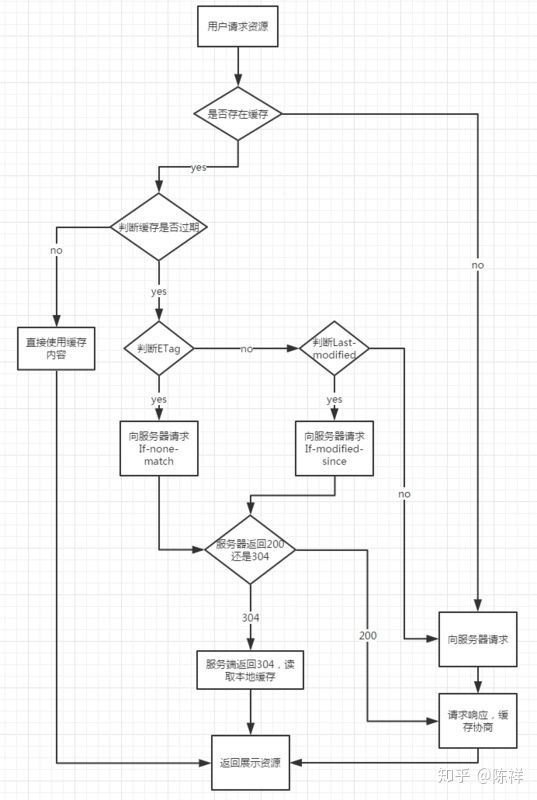
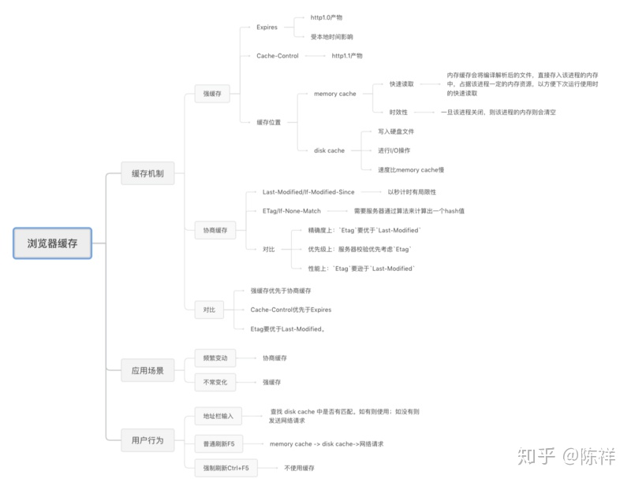
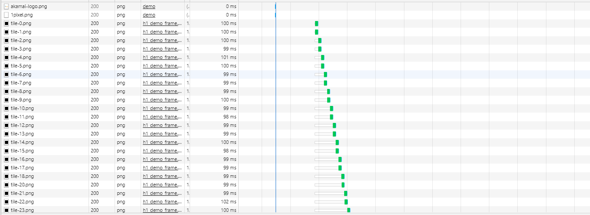
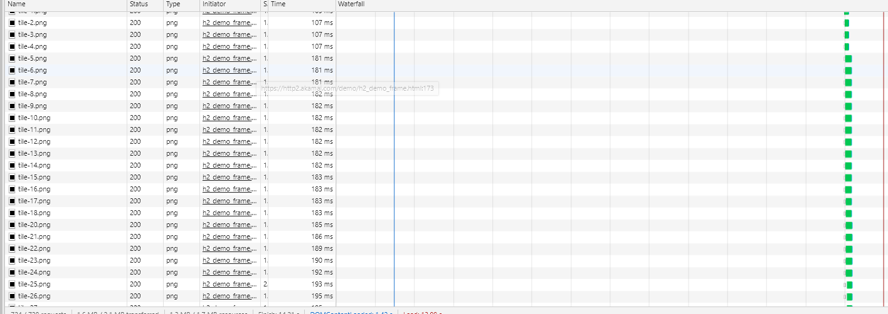

# http历史

## http0.9

1991年提出标准，只有get方法，只能响应html格式的数据。

## http1.0

1996年发布，增加了POST和HEAD命令，支持任何格式的内容，包括文字，图像，视频，二进制文件，更改了请求和响应格式。每次通信必须包括Header头,其中包含但不是全部
`Content-Type` 报文类型字段,不只限于超文本，json，二进制，表单，视频。
`Expires`  强缓存相关字段

> 缓存过期时间，用来指定资源到期的时间，是服务器端的具体的时间点。需要和Last-modified结合使用。Expires是Web服务器响应消息头字段，在响应http请求时告诉浏览器在过期时间前浏览器可以直接从浏览器缓存取数据，而无需再次请求。
> Expires:内容要求使用http日期格式，使用其他数值比如0，-1,单纯会被http当作过期。
> Expires 是 HTTP/1 的产物，受限于本地时间，如果修改了本地时间，可能会造成缓存失效。
> 当浏览器向服务器发起请求时，服务器会将缓存规则放入HTTP响应报文的HTTP头中和请求结果一起返回给浏览器，控制强制缓存的字段分别是Expires和Cache-Control，其中Cache-Control优先级比Expires高。Cache-Control是1.1的产物

`Last-Modified`,  协商缓存相关字段

`If-Modified-Since`  协商缓存相关字段

> Last-Modified和If-Modified-Since配合 实现协商缓存缓存头。
> Last-Modified和If-Modified-Since
> 浏览器首先发送一个请求，让服务端在response header中返回请求的资源上次更新时间，就是last-modified，浏览器会缓存下这个时间。
> 然后浏览器再下次请求中，request header中带上if-modified-since:[保存的last-modified的值]。根据浏览器发送的修改时间和服务端的修改时间进行比对，一致的话代表资源没有改变，服务端返回正文为空的响应，让浏览器中缓存中读取资源，这就大大减小了请求的消耗。
> 由于last-modified依赖的是保存的绝对时间，还是会出现误差的情况：
> 保存的时间是以秒为单位的，1秒内多次修改是无法捕捉到的；
> 各机器读取到的时间不一致，就有出现误差的可能性。为了改善这个问题，提出了使用etag。

`Authorization  `安全校验字段

> Authorization 身份认证。通常和HTTPS / TLS一起使用
> Authorization  认证分为基础认证和摘要认证，用户将账号和密码以 账户：密码 的形式
> 进行64base编码然后放入header头的Authorization  中交予服务端验证，
> 虽然简单，被广泛支持，但是这种方式验证并不安全，只适用于一些安全需求不高的场景。
> 现如今基本认证都配合https使用。
> 比如验证访问资源的来访者是否是某个我们指定来源。

`Connection`:长连接（默认close）

新增了状态码`200,304`等，多字符集支持；多部份类型（multi-part）；权限（authorization）；缓存（cache）；内容编码（content encoding）

##### 缺点

* 连接无法复用，每次请求都需要重新建立TCP链接。
* http队头堵塞，因为http1.0中，一个TCP只能包含一个http请求，并且浏览器中限制了TCP的连接数量，当页面中的请求很多并且某一个请求发生了堵塞，会导致剩余的资源必须等待其请求完成后才能发起请求，这会导致宽带无法被充分利用。（另外还有TCP堵塞，这里暂不记录）

## http1.1

* 发布于1997年，
  缓存优化：增加了cache-control字段进行更多的优化，
  例如 Entity tag，If-Unmodified-Since, If-Match, If-None-Match等更多可供选择的缓存头来
* 宽带优化，引入了range头域，允许之请求资源的某个部分，请求的状态返回码是206，
* 错误通知管理，新增了24个错误状态 响应码
* 长连接：默认了Connect:keep-alive，可以复用TCP连接,
* 一个Tcp上可以并行传送多个http请求，但是内部的响应依旧是有序串行的（管道化，可选操作）。减少了TCP链接创建和关闭的消耗。
  非管道化：一个TCP连接上，请求-》响应-》请求-》响应-》请求-》响应；
  管道化;一个TCP连接上，请求1-》请求2-》请求3-》响应1-》响应2-》响应3；
  管道化的请求必须是幂等请求，因为浏览器会对发生中断的未响应的请求重新发送。如果上述响应1发生了堵塞，那么请求2，3虽然在服务器发生了操作，但是由于请求1的响应堵塞，客户端无法接收到响应2，3.这时如果发生了意外中断，那么请求2，3将重新发送请求，非幂等请求就会出问题。

##### 缺点

* pipeing只解决了部分队头堵塞，pipeing虽然可以在一个tcp连接中发送多个请求，但是这些请求时有序的，遵循先请求先响应的原则，当某一条请求发生了堵塞，为了保持有序性，那么后续请求必须等待该请求完成才能被接受。
  解决队头堵塞的方案有 并发TCP连接，域名分片，但都会加大服务器的压力。
* 协议开销大，http1.x的header携带内容过大，并且header头的内容在请求时基本不会变化，尤其是在移动端，
* 单向请求

*本地测试时，发现设置max-age失效，原因是浏览器做了某种算法，同一tab页内，连续刷新会忽略强缓存策略，新打开一个tab页就可以了*

#### 控制缓存策略

1. 浏览器发送请求前，根据请求头的expires和cache-control判断是否命中
   （包括是否过期）强缓存策略，如果命中，直接从缓存获取资源，并不会发送请求。
   如果没有命中，则进入下一步。
2. 没有命中强缓存规则，浏览器会发送请求，
   根据请求头的last-modified和etag判断是否命中协商缓存，如果命中，
   直接从缓存获取资源。如果没有命中，则进入下一步。
3. 如果前两步都没有命中，则直接从服务端获取资源。

Cache-Control是最重要的规则，主要用于控制网页缓存，常用取值为：

- public：所有内容都将被缓存（客户端和代理服务器都可缓存）
- private：所有内容只有客户端可以缓存，
  默认取值 - no-cache：缓存内容，但是是否使用缓存则需要经过协商缓存来验证决定,
  等同于max-age=0;
- no-store：所有内容都不会被缓存，即不使用强制缓存，也不使用协商缓存
- max-age=xxx (xxx is numeric)：缓存内容将在xxx秒后失效
- must-revalidate，缓存失效后，使用协商缓存。

需要注意的是，no-cache这个名字有一点误导。设置了no-cache之后，并不是说浏览器就不再缓存数据，只是浏览器在使用缓存数据时，不走强缓存，而是需要先确认一下数据是否还跟服务器保持一致，也就是协商缓存。而no-store才表示不会被缓存，即不使用强制缓存，也不使用协商缓存。

当没有显示设置cache-control或是expire时, 大部分浏览器会使用启发式缓存, 把资源缓存下来;
我们可以从网络请求的size字段判断，该次访问来自

> from disk cache  磁盘缓存
> from memory cache  内存缓存
> 200  服务器下载
> 304  本地资源
>
> 当进入一个新的页面，会发现size=200；刷新后，发现size=from memory cache,重新打开发现size=from disk cache

## http2.0

SPDY协议时谷歌2009发布的基于TCP协议的应用层协议，目的是优化http协议的性能。他不是取代http的协议，而是一种增强。

相比于1.x的文本格式，

* http2.0采用二进制格式传输数据，解析更加高效，这是http2.0的核心，
* 为了保证HTTP不受影响，那就需要在应用层（HTTP2.0）和传输层（TCP or UDP）之间增加一个二进制分帧层。在二进制分帧层上，HTTP2.0会将所有传输的信息分为更小的消息和帧，并采用二进制格式编码，其中HTTP1.x的首部信息会被封装到Headers帧，而Request Body则封装到Data帧。

> `数据流`: 已建立的连接内的双向字节流，可以承载一条或多条消息。同一域名下的请求归属于同一个TCP。
>
> `消息`: 与逻辑请求或响应消息对应的完整的一系列帧。
>
> `帧`: HTTP/2 通信的最小单位，每个帧都包含帧头，至少也会标识出当前帧所属的数据流。
>
> 这些概念的关系总结如下:
>
> * 所有通信都在一个 TCP 连接上完成，此连接可以承载任意数量的双向数据流。
> * 每个数据流都有一个唯一的标识符和可选的优先级信息，用于承载双向消息。
> * 每条消息都是一条逻辑 HTTP 消息（例如请求或响应），包含一个或多个帧。
> * 帧是最小的通信单位，承载着特定类型的数据，例如 HTTP 标头、消息负载等等。 来自不同数据流的帧可以交错发送，然后再根据每个帧头的数据流标识符重新组装。

* 多路复用
  一个TCP连接中存在多个流，即可以同时发送多个请求，对端(服务器和客户端)可以通过帧中的标识知道该帧属于哪个请求。在客户端，这些帧乱序发送，到对端后再根据每个帧首部的流标识符重新组装。通过该技术，可以避免HTTP旧版本的队头阻塞问题，极大提高传输性能。（但是无法解决TCP队头堵塞的问题）

> 这是一个链接 [请求300多张图片的对比样例](https://http2.akamai.com/demo)
>
> http1请求
>
> 我们可以发现，刷新页面的同时，请求全部发出，但是每次最多只能同时响应两个请求，其它大部分请求处于等待pending的状态,甚至stalled最高达到6s,等待时间相当久。
>
> http2请求
> 刷新页面的同时，200条请求全部发出，但是等待的数据基本都很短暂。
>
> PS：
>
> stalled是指请求开始到请求发出的时间
>
> waiting是指请求发出到获得响应的时间
>
> shift+F5是强制刷新，不走浏览器缓存。

* Header压缩
  在HTTP1.0中，我们使用文本的形式传输header，在header中携带cookie的话，每次都需要重复传输几百到几千的字节，这着实是一笔不小的开销。
  在HTTP2.0中，我们使用了HPACK（HTTP2头部压缩算法）压缩格式对传输的header进行编码，减少了header的大小。并在两端维护了索引表，用于记录出现过的header，后面在传输过程中就可以传输已经记录过的header的键名，对端收到数据后就可以通过键名找到对应的值。
* 服务器Push
  在HTTP2.0中，服务端可以在客户端某个请求后，主动推送其他资源。
  可以想象一下，某些资源客户端是一定会请求的，这时就可以采取服务端push的技术，提前给客户端推送必要的资源，就可以相对减少一点延迟时间。在浏览器兼容的情况下也可以使用prefetch。

## http3.0

截至2021年1月，HTTP/3仍然是草案状态。
*我们可以在 Chrome 浏览器地址栏上输入 chrome://flags/ 来体验 QUIC。*
与其前任HTTP/1.1和HTTP/2不同，在HTTP/3中，**将弃用TCP协议，改为使用基于UDP协议的QUIC协议实现**
此变化主要为了解决HTTP/2中存在的队头阻塞问题。由于HTTP/2在单个TCP连接上使用了多路复用，受到TCP拥塞控制的影响，少量的丢包就可能导致整个TCP连接上的所有流被阻塞。
TCP协议在收到数据包之后，这部分数据可能是乱序到达的，但是TCP必须将所有数据收集排序整合后给上层使用，如果其中某个包丢失了，就必须等待重传，从而出现某个丢包数据阻塞整个连接的数据使用。
QUIC协议是基于UDP协议实现的，在一条链接上可以有多个流，流与流之间是互不影响的，当一个流出现丢包影响范围非常小，从而解决队头阻塞问题。
除此之外，QUIC协议没有了TCP握手和TLS握手，极大的节约了时间，

