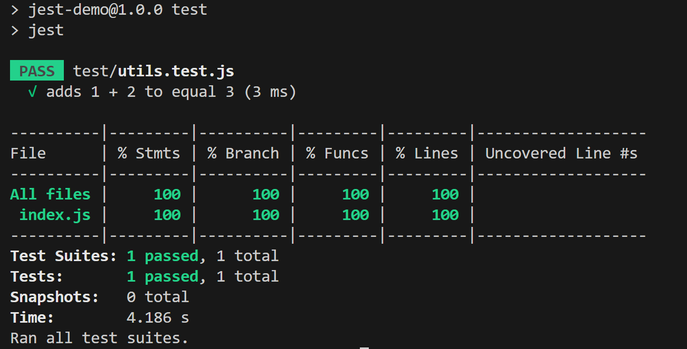

# [Jest自动化测试](https://jestjs.io/docs/getting-started)

[代码案例](./jest-demo/)

## 初始化Jest配置

1. 运行下列命令，Jest将会根据选择创建配置文件。
    ```linux
    npm init jest@latest
    ```
2. 使用Babel
    ```linux
    npm install --save-dev babel-jest @babel/core @babel/preset-env
    ```

    创建配置文件.babelrc

    ```JSON
    {
        "presets": [
        "@babel/preset-env"
        ]
    }
    ```


## 编写测试用例并运行

1. 编写需要测试的函数

    ```js
    // /utils/index.js
    export function sum(a, b) {
        return a + b;
    }
    ```
2. 创建测试文件

    ```js
    // /test/utils.test.js

    import {sum} from "../utils/index.js"

    test('adds 1 + 2 to equal 3', () => {
        expect(sum(1, 2)).toBe(3);
    });
    ```
3. 运行测试脚本

    ```json
    // package.json
    "scripts": {
        "test": "jest"
    }
    ```

    ```linux
    npm run test
    ```
    运行结果如下

    

## JEST 基础知识

### [匹配器](https://jestjs.io/zh-Hans/docs/using-matchers)

```js
test('two plus two is four', () => {
  expect(2 + 2).toBe(4);
});

test('对象赋值', () => {
  const data = {one: 1};
  data['two'] = 2;
  expect(data).toEqual({one: 1, two: 2});
});
```

### [测试异步代码](https://jestjs.io/zh-Hans/docs/asynchronous)

```js
test('the data is peanut butter', async () => {
  const data = await fetchData();
  expect(data).toBe('peanut butter');
});

test('the fetch fails with an error', async () => {
  expect.assertions(1);
  try {
    await fetchData();
  } catch (error) {
    expect(error).toMatch('error');
  }
});
```

### [测试开始回调和测试结束回调](https://jestjs.io/zh-Hans/docs/setup-teardown)

我们可能需要在测试函数开始前预先执行一些代码，或是函数结束后执行一些代码，可以使用Jest提供的下列函数

- `beforeAll`: 所有测试开始前执行一次
- `afterAll`: 所有测试结束后执行一次
- `beforeEach`: 每个测试开始前执行一次
- `afterEach`: 每个测试结束后执行一次

**上述函数只会发生在自己的测试文件内，不会影响其他测试文件**

上述函数存在执行顺序关系，关系如下

`beforeAll` => `beforeEach` => `afterEach` => `afterAll`


### [Jest工具](https://jestjs.io/zh-Hans/docs/jest-platform)

- jest-changed-files: 用于识别 git/hg 存储库中已修改文件的工具
- jest-diff：对比数据差异的可视化工具。
- jest-docblock：提取和解析 JavaScript 文件顶部注释的工具。
- jest-get-type：用于识别任何 JavaScript 值的原始类型的模块，

