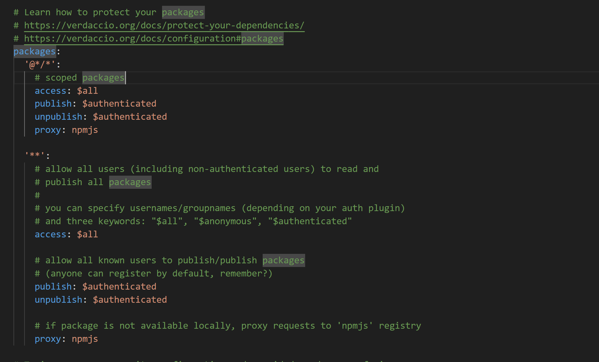
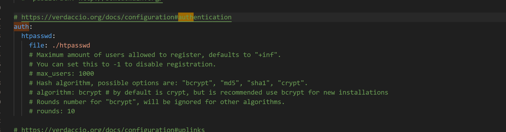

# 用户创建

目前任何人都可以像该私有仓库创建账号，并且访问，发布，删除包。

1. npm adduser --registry <verdaccio 仓库地址>
2. 即可进入私有仓库网站进行登录

## 私有仓库发布，删除，访问包的权限控制

目前任何人只要拥有账号，都可以访问，上传，发布，删除 npm 包，这肯定是不安全的，需要做权限控制，而 verdaccio 也提供了权限配置方案。

进入 verdaccio 配置文件，verdaccio 启动时可以看到配置文件地址

1. 修改配置文件

   `vim /verdaccio/config.yaml`

2. 配置如下

   

   包的配置分两种

   - 作用域包：一般指@xxx/xxx,比如@vue/core,@vue/compiler。
   - 普通的包：比如 react, vue, webpack。

   包配置有几个关键的属性

   - access：表示哪些用户可以访问私有库上的包。
   - publish：表示哪些用户可以在私有库上发布包。
   - unpublish：表示哪些用户可以在私有库上删除包。

   而上面三个配置项对应的选项位

   - $all: 代表所有用户，不管是已注册还是未注册。
   - $authenticated：是已注册的用户。
   - 固定的账号：比如 publish: user1 user2。

   根据上面的信息，可以知晓，我们一般需要把访问包权限设置为已经注册用户才可以访问，而 publish 发布包和 unpublish 删除包两个权限需要设置为固定配置的账号，修改后配置如下。

   ```yaml
   packages:
   '@*/*':
      # scoped packages
      access: $authenticated # 只有注册的账号才可以访问私有库的包
      publish: conaco zhangsan # 只有两个人的账号可以发布包到私有库
      unpublish: conaco # 只有该账号可以删除私有库上的包
      proxy: npmjs
   '**':
      access: $authenticated  # 只有注册的账号才可以访问私有库的包
      publish: conaco # 只有该账号可以发布包到私有库
      unpublish: conaco # 只有该账号可以删除私有库上的包
   ```

   修改完成后，还需要重启`pm2 restart verdaccio`才能生效。

## 启禁用用户注册功能

目前只要知道私有仓库地址，任何人都可以随意创建用户，对于私有仓库来说并不合适，我们可以关闭用户注册功能，需要创建的时候，由管理员开启即可。

1. 修改配置文件

   `vim /verdaccio/config.yaml`

2. 配置如下

   

   - files: 是用户的账号存储文件，默认是存在相对路径./htpasswd 文件。
   - max_users: 最多允许配置的用户个数，可以设置为-1 关闭添加用户功能。

   只需要把 max_users 的值设置为 -1，就不能添加用户了。在需要添加用户的时候就把 max_users 值注释掉，添加用户后再次设置为 -1 就可以了。

   ```yaml
    auth:
    htpasswd:
       file: ./htpasswd
       # Maximum amount of users allowed to register, defaults to "+inf".
       # You can set this to -1 to disable registration.
         max_users: -1
   ```

   修改完成后，还需要重启`pm2 restart verdaccio`才能生效。
