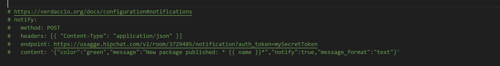

# 消息通知

当新版本的 npm 包发布到私有库时，需要让其他相关的同事能够及时知晓，就需要有个通知功能，而 verdaccio 自带了通知功能。

1. 修改配置文件

   `vim /verdaccio/config.yaml`

2. 配置如下

   

   - endpoint：webhook 推送地址。
   - content: 消息内容主体

   在 content 中 verdaccio 有几个内置变量可以直接使用，使用格式为 {{ name }}

   - name: 本次 npm publish 发布包的名称。
   - publisher.name：本次 npm publish 发布包的发布者名称。

   以下为钉钉通知的一个配置案例,`https://oapi.dingtalk.com/robot/send?access_token=access_token`为钉钉提供的 webhook 地址。

   ```yaml
   notify:
     method: POST
     headers: [{ "Content-Type": "application/json" }]
     endpoint: https://oapi.dingtalk.com/robot/send?access_token=access_token
     content: '{"msgtype": "text","text": {"content":"有新 npm 包发布了: 包名称：{{ name }}， 发布者：{{ publisher.name }}"}}'
   ```

    修改完成后，还需要重启`pm2 restart verdaccio`才能生效。
